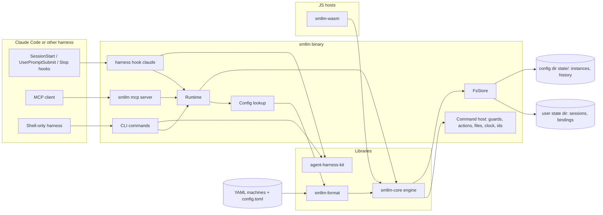
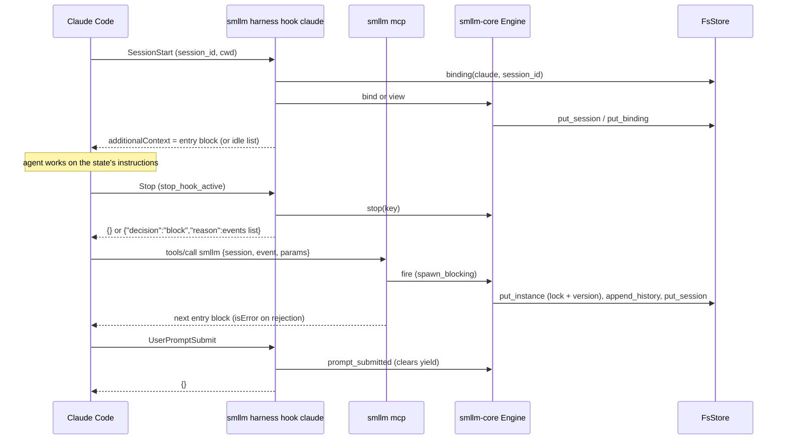
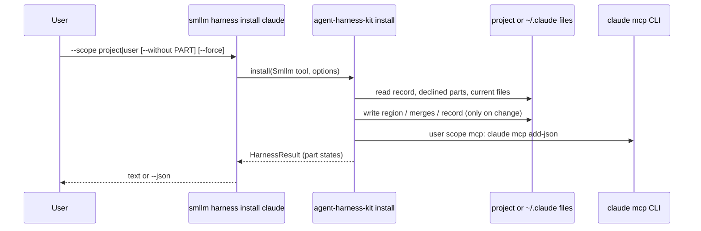

# Architecture

## Project Purpose

smllm (state machines for LLM agents) puts declarative state machines, written as a strict XState v5 subset in YAML, in charge of an LLM coding agent's turn loop. On entering a state the agent gets the state's instructions; when it tries to stop, a hook shows the offered events; the agent fires one through a single tool, `smllm({ session, event?, params? })`, and gets the next state's instructions. smllm is harness-agnostic with Claude Code first, ships as a Rust CLI, and its engine also runs in browsers and Node as WebAssembly.

## System Overview

- Engine (`smllm-core`): `no_std` + `alloc` state machine engine: model, instances, idle and built-in events, guards/actions dispatch, agent text rendering; all IO through host traits
- Format (`smllm-format`): YAML/TOML loading, validation and findings, JSON Schema, compile to JSON
- Harness kit (`agent-harness-kit`): shared, tool-neutral plumbing factored from sokf: harness parts install/status, marker regions, JSON merges, hook answers, findings, CLI conventions
- App (`smllm`): CLI, config lookup, file store, command host (guards and actions), Claude Code harness, MCP server
- WebAssembly (`smllm-wasm` + npm `smllm-wasm`): the engine for JavaScript hosts
- Distribution: npm launcher `smllm` + platform packages, crates.io crates, GitHub release archives, and a Claude Code plugin

## Technology Stack

- `Rust 1 (edition 2024)` — all crates
- `clap 4` — CLI parsing, completions (`clap_complete 4`), man page (`clap_mangen 0`)
- `serde 1` / `serde_json 1` — model, store and JSON output formats
- `serde-saphyr 1` — YAML state machine files (`smllm-format` only)
- `toml 1` / `toml_edit 0` — `config.toml` reading; in-place edits (`new --write`, declined parts)
- `schemars 1` — JSON Schema of the state machine format
- `rmcp 3` — MCP server (stdio)
- `tokio 1` — current-thread runtime for the MCP server only
- `regex 1` — param `pattern` matching in the CLI host
- `etcetera 0` — XDG / Known Folders user directories
- `getrandom 0`, `wait-timeout 0`, `thiserror 2` — session keys, command timeouts, errors
- `wasm-bindgen 0` — JavaScript bindings; `wasm-bindgen-cli` + `binaryen` (`wasm-opt`) at build time
- `proptest 1`, `insta 1`, `assert_cmd 2` — property, snapshot and end-to-end tests
- `Node 24` — npm packages, build/release/smoke scripts, wasm smoke test
- `cargo-nextest`, `cargo-llvm-cov`, `cargo-deny`, `cargo-zigbuild` — CI and release tooling

## High-Level Architecture



## Directory Structure

```
crates/lib/smllm-core/          # no_std engine: model, engine, host traits, records, render
crates/lib/smllm-format/        # std: source types, load, validate, lower, schema, compile
crates/lib/agent-harness-kit/   # std, published: harness, hook, report, cli modules (from sokf)
crates/lib/smllm-wasm/          # cdylib wasm-bindgen wrapper over smllm-core (publish = false)
crates/app/smllm/src/           # CLI entry, runtime, store, command host, paths, output
crates/app/smllm/src/commands/  # config, state, harness, mcp, graph, statusline command groups
crates/app/smllm/src/skills/    # skills installed by `harness install` (embedded)
crates/app/smllm/tests/         # end-to-end CLI and scripted-session tests
packages/smllm/                 # npm launcher selecting a platform package
packages/smllm-<os>-<arch>/     # npm platform packages carrying the binary
packages/smllm-wasm/            # npm package of smllm-wasm (web + bundler builds) + smoke test
plugin/                         # Claude Code plugin: hooks + MCP server + skills
docs/                           # user docs (statusline.md)
.claude-plugin/                 # Claude Code plugin marketplace manifest
examples/                       # showcase and dev configs used by tests and docs
.smllm/                         # dogfooding: this repo's own plan and quest machines (hooks in .claude/)
schema/                         # smllm.schema.json, generated by `smllm info schema` (test-checked)
scripts/                        # build-wasm, smoke, live-e2e, version and release scripts
submodules/sokf/                # source for agent-harness-kit
.github/workflows/              # checks (CI gate) and release pipelines
```

## Component Details

### smllm-core

The engine that runs the turn loop over a host, with no IO, time or randomness of its own.

RESPONSIBILITIES

- Model of machines, states, transitions, guards, actions and event params
- Protocol: `bind`, `view`, `menu`, `fire`, `stop`, `prompt_submitted`, `status` (read-only, for status lines)
- Instances, idle and built-in events, visits, history entries
- Render all agent text (`<smllm>` blocks) and the agent rules
- Host traits: `Store`, `Guard`, `Action`, `InstructionSource`, `Matcher`, `Clock`, `Ids`; an in-memory store

CONSTRAINTS

- `no_std` + `alloc`; WASM size rules in `.zen/rules/rust-rules.md`
- Optional `serde` feature; `std` feature only adds `std::error::Error`

### smllm-format

Turns YAML machines and `config.toml` files into the core model with findings.

RESPONSIBILITIES

- Parse and validate machine files; collect findings (error / warning / info) with file, line, YAML path, hint
- Combine user and project configs; give each machine its state directory
- Generate the format's JSON Schema, templates, and compiled JSON for wasm hosts

### agent-harness-kit

Tool-neutral plumbing shared with sokf, with no smllm dependency.

RESPONSIBILITIES

- `harness`: `Tool` trait, profiles of parts (`file`, `region`, `merge`, `external`), part states, `install` / `status`, record file, declined-parts store
- `hook`: Claude Code `HookInput`, `Answer`, `emit`, `LoopGuard`
- `report`: findings and their text/JSON forms
- `cli`: exit codes, stdout writing, broken pipe handling, `error:` runner

CONSTRAINTS

- Every file derived from sokf starts with `// Derived from sokf <commit> <path>`
- Embeds no tool content; published on crates.io

### smllm app

The binary: CLI surface plus the std host of the engine.

RESPONSIBILITIES

- CLI commands and conventions (CLI-Commands, CLI-Lookup, CLI-Graph)
- File store for sessions, bindings, instances and history (STO-FileStore)
- Command runner for `command` guards and actions (DEC-CommandRunner)
- Wiring configs, engine and host per call (HOST-Runtime)
- Claude Code hooks and `harness install|status` (HOST-Claude); stdio MCP server (HOST-Mcp)
- `smllm statusline` row / JSON for harness status lines, and the `smllm-statusline` setup skill (STL)

### smllm-wasm

The engine for JavaScript, with the host supplied by one JS object.

RESPONSIBILITIES

- `Engine` class over compiled JSON: `bind`, `view`, `events`, `fire`, `stop`, `promptSubmitted`, `status`, `exportState` / `importState`
- Build to web and bundler targets, optimise with `wasm-opt -Oz`, publish as npm `smllm-wasm`

CONSTRAINTS

- Depends on `smllm-core` only; size budget enforced by `scripts/build-wasm.mjs`

### Claude Code plugin

One-command install of the hooks, MCP server and status line skill for Claude Code.

RESPONSIBILITIES

- `plugin/hooks/hooks.json` wiring the three hooks to `smllm harness hook claude <HOOK>`
- `plugin/.mcp.json` registering `smllm mcp`; marketplace entry in `.claude-plugin/marketplace.json`
- `plugin/skills/smllm-statusline/` (a copy of the app's embedded skill, test-checked)

CONSTRAINTS

- Needs the `smllm` binary on `PATH`; adds no instructions block (the tool description carries the rules)

## Component Interactions

Every surface (hook, MCP tool, CLI, wasm) builds a host and calls the same core protocol. The hooks deliver entry blocks and events lists to the agent; the agent answers through the one tool. Each call loads the configs recorded on its session, runs the engine against the file store and command host, and writes atomically.

### Turn loop



### Harness install



## Architectural Rules

- `smllm-core` has no IO, time, randomness, regex or process spawning; hosts supply them (NFR-1)
- `smllm-core` builds for `wasm32-unknown-unknown` without default features; `smllm_wasm_bg.wasm` stays within its 300 KiB budget (NFR-8); follow the WASM size rules in `.zen/rules/rust-rules.md`
- Parsing, validation and std-only code live in `smllm-format` or the app, never the core
- Hooks never wedge the agent: a failure exits 1 with stderr only; no config means `{}` (NFR-4, HOST-7, HOST-8)
- `smllm statusline` never blanks the host's status line: it always exits 0, printing nothing (or `{}`) on failure (STL-4)
- `harness install` never changes the user's `statusLine` setting; the skill does, with consent (D2-2)
- Guard and action commands get LLM input only as `SMLLM_*` environment variables, never by interpolation (NFR-5, DEC-6)
- Every store write is atomic; instance writes are locked and versioned (STO-3)
- Exit 2 leaves every file as found (NFR-6)
- Files ≤ 800 lines; module rules in `.zen/rules/rust-rules.md` (NFR-7)
- No new dependency without user approval; versions hoisted to the workspace `Cargo.toml`
- `agent-harness-kit` has no smllm dependency
- Tests: core snapshots and properties, scripted sessions, wasm smoke; the live-model test runs only on explicit human request (TEST-4)
- CI line coverage ≥ 90% per crate group (`npm run coverage:check`)

## Release Status

STATUS: Alpha

Pre-0.1 release. Engine, format, store, Claude Code harness, MCP server and wasm package are implemented; CLI, JSON forms and file formats may change before 1.0.

## Developer Commands

- `npm run build` — `cargo build --workspace`
- `npm test` — `cargo nextest run --workspace`
- `npm run check` — `cargo check --workspace --tests`
- `npm run lint` — `cargo clippy --workspace`
- `npm run fmt` — `cargo fmt --all`
- `npm run dev -- <args>` — run the CLI from source
- `npm run coverage` / `coverage:summary` / `coverage:check` — nightly llvm-cov; `check` enforces 90% lines
- `npm run build:wasm` — build `packages/smllm-wasm` (cargo → wasm-bindgen → wasm-opt), print size, fail over budget
- `npm run test:wasm` — Node smoke test of the wasm package
- `npm run test:launcher` — npm launcher unit tests
- `npm run smoke` — behavioural smoke test of `target/release/smllm`
- `npm run smoke:launcher` — packed launcher + platform package smoke test
- `npm run set-version -- <v>` / `npm run verify-version` — lockstep versions across Cargo and npm
- `npm run build:<os>-<arch>` / `build:all` — release binaries via cargo-zigbuild
- `cargo build -p smllm-core --no-default-features --target wasm32-unknown-unknown` — check the core stays `no_std`
- `SMLLM_LIVE=1 node scripts/live-e2e.mjs` — live-model test; human request only

## Change Log

- 0.1.0 (2026-09-25): Initial architecture (PLAN-001)
- 0.2.0 (2026-09-25): Status line: `Engine::status`, `smllm statusline`, skill part, docs/ (PLAN-002)
