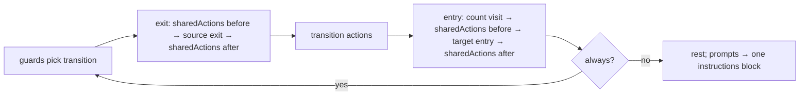
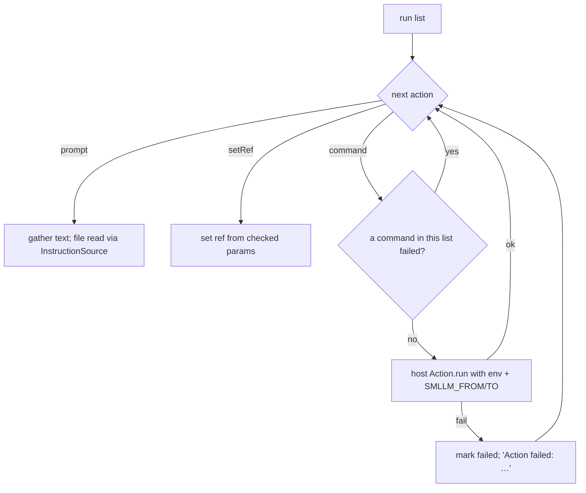

# Design Specification

## Overview

Action execution has no component of its own: it is the `take`/`enter`/`exit`/`run` part of ENG-Turn (DESIGN-ENG-engine.md), with the built-ins' action behaviour in ENG-Machine and IDLE-Idle, and `command` actions run by the host's `Action` trait (DEC-CommandRunner in the CLI). This document describes how those pieces realise REQ-ACT-actions.md.

## Architecture

AFFECTED LAYERS: smllm-core (ENG-Turn, ENG-Machine, IDLE-Idle, ENG-Engine), app host

### High-Level Architecture

An external transition runs three phases; each state phase expands to shared-before lists, the state's own list, then shared-after lists (CFG-11). Each list is run by `Turn::run`.





### Module Organization

```
crates/lib/smllm-core/src/engine/turn.rs     run, prompt, enter, exit, take, lists (ENG-Turn)
crates/lib/smllm-core/src/engine/machine.rs  park / unmatched / resume / yield (ENG-Machine)
crates/lib/smllm-core/src/engine/idle.rs     start: enter/resume entry (IDLE-Idle)
crates/lib/smllm-core/src/engine/api.rs      unsupported() (ENG-Engine)
crates/app/smllm/src/host.rs                 Commands as Action (DEC-CommandRunner)
```

### Architectural Decisions

- COMMANDS RUN, PROMPTS GATHER: commands execute when reached; prompt text is appended to `Turn.prompts` in the same order and rendered once as `<instructions>` (ACT-2). The order is exit → transition actions → shared-before → entry → shared-after, across every state passed through by `always`
- FAILED COMMANDS SKIP ONLY THEIR LIST'S COMMANDS: after a failure, later `command` actions of the same list are skipped; prompts and `setRef` in that list still run, and later lists (e.g. the target's entry after a failed transition action) run normally. Rationale: the agent always gets its instructions plus the failure line (ACT-3). Alternatives: skip the list's prompts too
- SETREF IS A CORE ACTION: validated before the transition is taken (INST-3); inside `run` it only copies the checked ref param
- PROMPT FILE FAILURES ARE REPORTED, NOT FATAL: a missing named file adds `Prompt failed: <file>: not found`; a read error adds `Prompt failed: <file>: <error>`; the implied `enter-<STATE>.md` (`Prompt::DefaultFile`) is skipped silently when absent
- VIEW DOES NOT RUN ACTIONS: the read-only view re-renders entry prompts only (ENG-5)
- UNSUPPORTED KINDS AS FINDINGS: `Engine::unsupported` lists `<machine>.<state|sharedActions>: action type <kind> is not supported by this host` for hosts to report at load (ACT-6)

## Components and Interfaces

### ENG-Turn (by reference)

Defined in DESIGN-ENG-engine.md. The action-related surface:

IMPLEMENTS: ACT-1_AC-1, ACT-2_AC-1, ACT-3_AC-1

```rust
pub(crate) struct ListLabel<'s> { pub what: &'s str, pub state: &'s str,
                                  pub from: Option<&'s str>, pub to: Option<&'s str> }
impl Turn<'_, '_> {
    fn run(&mut self, inst: &mut Instance, list: &[ActionDef], label: &ListLabel<'_>);
    fn prompt(&mut self, prompt: &Prompt);
    fn take(&mut self, m: &Machine, inst: &mut Instance, source: &str, t: &Transition);
}
```

### Built-in action behaviour (by reference)

ENG-Machine and IDLE-Idle (DESIGN-ENG, DESIGN-IDLE):

- `park`: `exit(from, to: None)` → parked → idle
- `unmatched`: to fallback: `exit(from)` → `enter(fallback)` → settle; to idle: `exit(from, to: None)` → suspended
- `resume` (fallback): `exit(fallback)` → `enter(interrupted)` → settle
- `enter` / `resume` (idle): `start` → `enter(target)` → settle; no exit (the instance was not in a state)
- `yield`: no actions

IMPLEMENTS: ACT-5_AC-1

## Data Models

### Core Types

- LIST LABELS in failure lines: `<STATE> entry`, `<STATE> exit`, `actions`, `sharedActions[i] entry|exit`

```rust
// "Action failed: WORK entry[0] command: exited 128: boom"
// "Action failed: actions[0] command: timed out after 300s"
// "Prompt failed: work.md: not found"
```

## Correctness Properties

- ENG_P-1 (DESIGN-ENG): action order and failure reporting are deterministic for the same host outcomes
  VALIDATES: NFR-3, ACT-1_AC-1

## Error Handling

### Action outcomes

- ACTION_FAILED: host `Outcome { ok: false }`; detail from DEC-CommandRunner
- PROMPT_FAILED: named prompt file missing or unreadable

### Strategy

PRINCIPLES:

- Actions never reject a call and never undo a transition (ACT-3)
- Failures are shown in the next header and written to the history trace

## Testing Strategy

### Property-Based Testing

- FRAMEWORK: proptest (see DESIGN-ENG)
- MINIMUM_ITERATIONS: 128
- TAG_FORMAT: @zen-test: ENG_P-n

### Unit Testing

- AREAS: `failed_actions_are_reported_and_never_block` (failed entry command + missing prompt file, transition still taken); `arrive_in_work` / `final` snapshots (shared-before prompt precedes own entry; transition-action prompt precedes final entry prompt); recorded env with `SMLLM_TO` and params; `unsupported_kinds_are_listed`

## Requirements Traceability

SOURCE: .zen/specs/REQ-ACT-actions.md

- ACT-1_AC-1 → ENG-Turn (`take`, `enter`, `exit`, `settle`)
- ACT-2_AC-1 → ENG-Turn (`run`, `prompt`); TURN-Render renders the block
- ACT-3_AC-1 → ENG-Turn (`run`) — interpreted as skipping the rest of the list's commands only; prompts still shown
- ACT-4_AC-1 → ENG-Turn (`env` with from/to), DEC-CommandRunner (same `run_command` as guards); no @zen-impl marker
- ACT-5_AC-1 → IDLE-Idle (`start`), ENG-Machine (park, unmatched, resume, yield)
- ACT-6_AC-1 → ENG-Engine (`unsupported`) [partial] exposed by the core and `smllm-wasm`; the CLI app does not call it (its host supports only `command`, which the validator already accepts)

## Change Log

- 1.0.0 (2026-09-25): Initial design, documenting the P6 implementation
