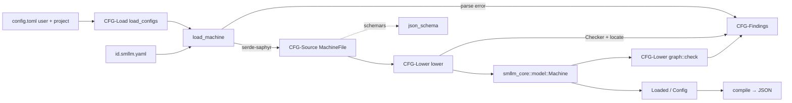

# Design Specification

## Overview

`smllm-format` (std) turns a state machine file (REQ-CFG-format) into the validated `smllm_core::model` the engine runs. It parses YAML into source types that mirror the file, walks them with a checker that collects every finding, lowers them into the core model, and then runs whole-graph checks. The same source types produce the JSON Schema. Config loading combines the user and project `config.toml`s. `smllm compile` serialises the result with prompt files inlined, for wasm hosts. Nothing is templated, which is how CFG-17 is met.

## Architecture

AFFECTED LAYERS: smllm-format (parse, check, lower), smllm-core model (target types), smllm app (CLI and MCP callers)

### High-Level Architecture

A linear pipeline. A YAML syntax error is one finding (the document cannot be read further). A readable document is then checked for shape by `shape.rs` — a walk of the generic tree against the format that reports every unknown key, wrong type and unsupported XState feature with its path and line. Only a well-shaped document is deserialised into the source types and goes through the semantic checks; a machine is returned only when none of its findings is an error.



### Module Organization

```
crates/lib/smllm-format/src/
├── lib.rs            public API re-exports
├── source/
│   ├── machine.rs    MachineFile and nested source types (CFG-Source)
│   └── forms.rs      OrderedMap, OneOrMany, StringOr, Run: hand-written visitors
├── lower/
│   ├── checker.rs    Checker: collects findings, YAML path → line
│   ├── machine.rs    lower(), transitions, reachable() (CFG-Lower)
│   ├── events.rs     meta.instance, meta.events, params, require_ref (CFG-Lower)
│   ├── actions.rs    actions, guards, prompts, default prompt, fences (CFG-Lower)
│   └── graph.rs      reachability, final states, always loops (CFG-Lower)
├── load.rs           load_machine, load_configs, parse_message (CFG-Load)
├── finding.rs        Finding, Findings, Level (CFG-Findings)
├── locate.rs         locate(): line of a YAML path in block or flow YAML
├── schema.rs         json_schema()
├── template.rs       machine_template(), config_template()
└── compile.rs        compile() (CLI-13)
crates/lib/smllm-format/tests/
├── validate.rs
├── fixtures/bad/     rules, version, xstate fixtures
└── snapshots/        insta snapshot of every finding
```

### Architectural Decisions

- XSTATE V5 SUBSET PLUS META: the file is a plain XState v5 config, and smllm data lives only under `meta`, so Stately's tools and a JS XState host can read it (D19). Alternatives: a custom YAML schema, the superdev v2 format
- DENY UNKNOWN FIELDS ON EVERY SOURCE TYPE: unsupported XState keys fail at parse time, and the error carries a v1 hint (CFG-2_AC-1). Alternatives: parse leniently and warn afterwards
- HAND-WRITTEN POLYMORPHIC VISITORS: `OneOrMany`, `StringOr` and `OrderedMap` implement `Visitor` directly, so a mistake inside an item reports the real error at its YAML location, not "did not match any variant". Alternatives: `#[serde(untagged)]`
- JSON SCHEMA FROM THE SOURCE TYPES: `schemars::schema_for!(MachineFile)` means the schema cannot drift from the parser (CFG-15_AC-1). Alternatives: a hand-maintained schema file
- SERDE-SAPHYR FOR YAML: it is maintained and reports locations; `serde_yaml` is unmaintained (PLAN-001 §12). Alternatives: `serde_norway`
- SEPARATE SOURCE AND MODEL TYPES: the source types mirror the file for serde and schemars, while `smllm_core::model` stays no_std, is resolved (defaults applied, the ref param required), and carries no parsing concerns (D24). Alternatives: deserialize straight into the core model
- PROMPT FILES RESOLVED TO ABSOLUTE PATHS: lowering stores `Prompt::File(<abs>)`, which the host reads at request time so edits show without reloading. `compile` (`Files.inline`) reads the files and stores `Prompt::Text` instead, because browser hosts have no files. Alternatives: always inline
- IMPLIED DEFAULT PROMPT: a state with no `prompt` entry action gets `Prompt::DefaultFile(<dir>/enter-<STATE>.md)`, which is read only if the file exists. When inlining, a missing file adds no prompt
- NEVER TEMPLATE: user text is copied verbatim into the model, and neither the format nor the renderers substitute anything, so braces stay literal (CFG-17_AC-1)
- SEMANTICS IN THE CORE, CHECKS IN THE FORMAT: runtime XState behaviour (CFG-3_AC-1, CFG-11_AC-1 ordering) is implemented in `smllm-core` ENG-Turn. This crate only guarantees the model is well formed

## Components and Interfaces

### CFG-Source

Serde and schemars types that mirror the YAML file one to one. Every struct uses `deny_unknown_fields` and `rename_all = "camelCase"`. Actions and guards are adjacently tagged enums (`tag = "type", content = "params"`). `forms.rs` provides the XState shapes:
- `OrderedMap` keeps file order and rejects duplicate keys
- `OneOrMany` accepts one item or a list
- `StringOr` accepts a bare string (a target name, or `setRef`) or an object
- `Run` accepts a shell string or an argv list

Each form has a matching `JsonSchema` impl, so the generated schema accepts the same shapes the parser does.

IMPLEMENTS: CFG-15_AC-1 (via `schema.rs`, derived from these types)

```rust
pub struct MachineFile { pub id: String, pub description: Option<String>, pub initial: String,
    pub meta: MachineMeta, pub states: OrderedMap<StateNode> }
pub struct StateNode { pub description: Option<String>, pub kind: Option<StateType>,
    pub meta: Option<StateMeta>, pub entry: Option<Actions>, pub exit: Option<Actions>,
    pub on: Option<OrderedMap<Transitions>>, pub always: Option<Transitions> }
pub type Transitions = OneOrMany<StringOr<TransitionSrc>>;
pub type Actions = OneOrMany<StringOr<ActionSrc>>;
pub enum ActionSrc { Prompt(PromptParams), Command(CommandParams), SetRef }
pub enum GuardSrc { Command(CommandParams), Visits(VisitsParams) }
pub fn json_schema() -> String;
```

### CFG-Lower

`lower()` walks a parsed `MachineFile` once, in this order:
1. Machine checks: format version, id, states and initial.
2. `meta.instance`, which applies the defaults and compiles `ref.pattern` with `regex`.
3. `meta.events`, which lowers params to `ParamSpec`, rejects non-string types, and lets built-ins set only `description`.
4. Each state: its entry and exit actions (adding the implied default prompt), `on` (rejecting built-in names, and recording events that have `setRef`), `always`, and `meta.paramDescriptions` checked against the declared params.
5. `meta.sharedActions`.
6. `require_ref` for every event with `setRef`, then the unused-event and ref-name-clash checks.

`lower_transitions` checks that each target exists and reports an error if the last candidate is guarded. `lower_actions` rejects `setRef` outside `on` transition actions, resolves a prompt `file` against the machine's directory, and warns about smllm's fence tags in any text. After lowering, `graph::check` walks `reachable()` from the initial state, the entry points and the fallback state. It warns about unreachable states, adds an info finding when there is no final state, and runs a DFS over the `always` edges to report each cycle once. The function returns `None` if the checker recorded any error.

IMPLEMENTS: CFG-1_AC-1, CFG-6_AC-1, CFG-7_AC-1, CFG-9_AC-1, CFG-12_AC-1, CFG-13_AC-1 (also IDLE-1_AC-1, DEC-2_AC-2, TURN-12_AC-2 from other specs)

```rust
pub(crate) struct Files<'a> { pub dir: &'a Path, pub inline: bool }
pub(crate) struct Checker<'a> { pub file: &'a Path, pub text: &'a str, pub findings: Findings }
impl Checker<'_> {
    pub(crate) fn add(&mut self, level: Level, path: &[String], message: String,
        hint: Option<&str>, rule: &'static str);
}
pub(crate) fn lower(c: &mut Checker<'_>, files: &Files<'_>, file: &MachineFile) -> Option<Machine>;
pub(crate) fn reachable(m: &Machine) -> HashSet<String>;
pub fn locate(text: &str, path: &[&str]) -> Option<usize>;
```

### CFG-Load

`load_machine` reads the file and parses it with `serde_saphyr::from_str`. On a parse error it records one `CFG-1` finding with serde-saphyr's line. `parse_message` strips the `line N column M:` prefix and adds a v1 hint when the unknown field or variant is an unsupported XState feature. On success it builds a `Checker` over the source text and calls `lower`.

`load_configs` takes the config files in order (user, then project, or a single explicit file). Each TOML file is parsed with `deny_unknown_fields` and kebab-case keys, and a TOML error's span is turned into a line number. It loads every listed machine relative to that config and reports duplicate ids within one config as errors. A machine whose id is already loaded from an earlier config replaces it, with an info finding. The last `[idle] on-enter` seen wins. Each machine's `MachineSource.state_dir` is `state/` beside the config that lists it.

IMPLEMENTS: CFG-2_AC-1, CFG-14_AC-1, CFG-15_AC-2

```rust
pub enum Origin { User, Project, Explicit }
pub struct ConfigFile { pub path: PathBuf, pub origin: Origin }
pub struct MachineSource { pub id: String, pub file: PathBuf, pub config: PathBuf, pub state_dir: PathBuf }
pub struct Loaded { pub config: Config, pub machines: Vec<MachineSource>, pub findings: Findings }
pub fn load_machine(path: &Path, inline: bool) -> (Option<Machine>, Findings);
pub fn load_configs(files: &[ConfigFile], inline: bool) -> Loaded;
pub fn compile(path: &Path) -> (Option<String>, Findings);
```

### CFG-Findings

A plain value type that every stage appends to. It never short-circuits: stages keep checking after an error, and only the final "any error?" decision drops the machine. `render` produces the one-line text form, with the hint on an indented second line; the CLI renders through agent-harness-kit instead, with the hint inline as `… — <hint> (<rule>)`. The type is serde-serialisable (camelCase) for `--json` output.

```rust
pub enum Level { Error, Warning, Info }
pub struct Finding { pub level: Level, pub file: PathBuf, pub line: Option<usize>,
    pub path: Option<String>, pub message: String, pub hint: Option<String>, pub rule: &'static str }
pub struct Findings(pub Vec<Finding>);
impl Finding { pub fn render(&self) -> String; }
impl Findings { pub fn has_errors(&self) -> bool; pub fn count(&self, level: Level) -> usize; }
```

## Data Models

### Core Types

- SOURCE TYPES: `smllm_format::source::*`, which mirror the file (see CFG-Source). Only parsing and the schema use them
- MACHINE: `smllm_core::model::Machine`, the lowered, validated form: instance vocabulary resolved, events as `SmallMap<EventDef>` with the ref param made required by `setRef`, and states with `entry`, `exit`, `on`, `always` and `param_descriptions`
- ACTION AND GUARD: `smllm_core::model::{ActionDef, GuardDef, Prompt, Value}`. Host-run kinds (`command`) become `Host { kind, params }` with a `SmallMap<Value>`; `cwd` is resolved to an absolute path. `visits` becomes `GuardDef::Visits`, which the core evaluates
- CONFIG: `smllm_core::model::Config` holds the machines in load order plus the idle prompt actions. `compile` serialises it

```rust
pub enum Prompt { Text(String), File(String), DefaultFile(String) }
pub enum ActionDef { Prompt(Prompt), SetRef, Host { kind: String, params: SmallMap<Value> } }
pub enum GuardDef { Visits { state: String, at_least: u32 }, Host { kind: String, params: SmallMap<Value> } }
```

## Correctness Properties

None are defined for this crate. The format's rules are checked by example-based fixture and snapshot tests (see Testing Strategy). The engine's properties are in the ENG and TURN designs.

## Error Handling

### Finding levels

Every problem is a `Finding` whose `rule` field holds the ID of the requirement it enforces.

- ERROR: the machine or config does not load. Examples: parse failure, unknown key, missing target, guarded last transition, `always` loop
- WARNING: probably a mistake, but the machine still loads. Examples: unused declared event, unreachable state, fence text, `on` beside `always`
- INFO: worth knowing. Examples: no final state, a project machine replacing a user machine

### Strategy

PRINCIPLES:

- Collect all findings; never stop at the first (shape problems all at once; semantic checks once the shape is valid)
- Rendered as `<file>:<line>: <level>: <path>: <message> (<rule>)`, with the line and path left out when unknown and `  hint: <hint>` on the next line
- The line comes from serde-saphyr for parse errors and from `locate` (block and flow YAML, falling back to the deepest ancestor found) for semantic findings
- A machine with any error is left out of `Loaded.config`, and the other machines still load
- IO errors (unreadable files, missing prompt files) are findings, not panics

## Testing Strategy

### Property-Based Testing

- FRAMEWORK: proptest (used in smllm-core and agent-harness-kit; smllm-format has no property tests)
- MINIMUM_ITERATIONS: 0 (not applicable to this crate)
- TAG_FORMAT: @zen-test: CFG_P-{n}

### Unit Testing

Inline `#[cfg(test)]` modules.

- AREAS: `locate` (block and flow keys, list items, ancestor fallback), `parse_message` (prefix stripping, v1 hints), `machine_template` (loads without errors), `config_template` (parses)

### Integration Testing

`tests/validate.rs` runs the public API over real files.

- SCENARIOS: `examples/showcase` and `examples/dev` load with no errors or warnings; the showcase lowers as written (setRef makes the ref required, the implied default prompt, reenter, `always` with `visits`, shared actions, fallback); `tests/fixtures/bad/rules.smllm.yaml` produces every rule violation, captured in an insta snapshot of all rendered findings; the unsupported-XState hint; the version and missing-prompt-file errors; project config wins over user config and `[idle]` is replaced; `compile` inlines prompts and round-trips through serde; the JSON Schema's title, required keys and action and guard kinds

## Requirements Traceability

SOURCE: .zen/specs/REQ-CFG-format.md

- CFG-1_AC-1 → CFG-Lower
- CFG-2_AC-1 → CFG-Load
- CFG-3_AC-1 → CFG-Lower, ENG-Turn — format checks that targets exist and lowers `reenter`; runtime semantics are in ENG-Turn (smllm-core `engine/turn.rs`); no test marker
- CFG-4_AC-1 → CFG-Lower (`lower/actions.rs`) — no @zen-impl marker or test marker yet
- CFG-5_AC-1 → CFG-Lower (`lower_guard`) — evaluation is in DEC-CommandRunner and the core; no markers
- CFG-6_AC-1 → CFG-Lower — no test marker
- CFG-7_AC-1 → CFG-Lower — no test marker
- CFG-8_AC-1 → CFG-Lower — no @zen-impl marker; the core uses the first transition `description` as guidance
- CFG-9_AC-1 → CFG-Lower
- CFG-10_AC-1 → CFG-Source — enforced by `deny_unknown_fields` on `MachineMeta` and `StateMeta`; no markers
- CFG-11_AC-1 → CFG-Lower, ENG-Turn — lowering here; before/after ordering is applied in ENG-Turn
- CFG-12_AC-1 → CFG-Lower — no test marker
- CFG-13_AC-1 → CFG-Lower
- CFG-14_AC-1 → CFG-Load, CFG-Findings
- CFG-15_AC-1 → CFG-Source — template in `template.rs`; `smllm info schema` in the app
- CFG-15_AC-2 → CFG-Load — covered by `project_wins_over_user_and_idle_is_replaced`, which lacks a @zen-test marker
- CFG-16_AC-1 → CFG-Lower, HOST-Mcp — definition side here (non-string param type is an error); tool side in HOST-Mcp (`commands/mcp.rs`)
- CFG-17_AC-1 → CFG-Lower — met by never templating; no test marker

## Library Usage

### External Libraries

- serde-saphyr (1.3): YAML deserialisation with locations
- schemars (1.2): JSON Schema from the source types
- serde, serde_json: derives; compile output; schema printing
- toml (1.1): `config.toml`
- regex (1.13): validating `pattern` values
- insta (1.47, dev): findings snapshot

## Change Log

- 0.1.0 (2026-09-25): Initial design
