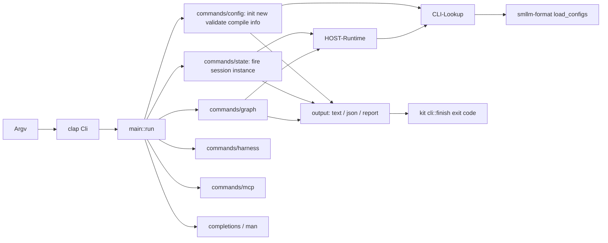

# Design Specification

## Overview

Implements REQ-CLI as a clap-derive CLI in `crates/app/smllm`. `main` parses, handles `-V` itself, and dispatches each command to a function returning an exit code; `agent_harness_kit::cli::finish` turns an `Err` into `error: <message>` and exit 2. Commands that need machines load them through `HOST-Runtime` (configs from CLI-Lookup, or those recorded on a session). Output goes through `output.rs`: text, one JSON line, or a findings report rendered by the kit. Harness commands (CLI-7..9) are in HOST-Claude and HOST-Mcp.

## Architecture

AFFECTED LAYERS: smllm app (cli, paths, output, commands), smllm-format, agent-harness-kit (report, cli)

### High-Level Architecture



### Module Organization

```
crates/app/smllm/src/
├── main.rs            # parse, -V, dispatch, completions
├── cli.rs             # clap types (CLI-Commands)
├── paths.rs           # user dirs, config lookup (CLI-Lookup)
├── output.rs          # text, JSON line, findings → kit Report
├── error.rs           # Error (Io | Msg | Engine | Harness) → exit 2
├── man.rs             # roff man page with COMMANDS, EXIT STATUS, FILES
└── commands/
    ├── config.rs      # init, new, validate, compile, info schema (CLI-Commands)
    ├── state.rs       # fire, session, instance (CLI-Commands)
    ├── graph.rs       # graph (CLI-Graph)
    ├── harness.rs     # HOST-Claude
    └── mcp.rs         # HOST-Mcp
```

### Architectural Decisions

- CLAP DERIVE WITH GLOBAL OPTIONS: `--config` and `-V` are `global = true`, so they work before or after the command; clap's built-in version flag is disabled so the output is `smllm x.y.z`
- HIDDEN PLUMBING COMMANDS: `mcp`, `man` and `harness hook` are hidden from help
- SESSION COMMANDS USE THE SESSION'S CONFIGS: `fire --session`, `session show` load via `Runtime::for_session`; keyless `fire` and `instance`/`graph` use lookup from cwd
- FINDINGS THROUGH THE KIT: `smllm-format` findings are mapped to kit `Finding`s (YAML path and hint folded into the message, rule id as authority) so text and JSON match sokf
- EDITS KEEP FORMATTING: `new --write` registers the file with `toml_edit`, written atomically (STO-3_AC-1)
- JSON OUTPUT SCHEMAS DEFERRED: `--json` prints one object, but its schemas are not yet published (PLAN-001 §9 convention). Alternatives: schemars-derived output types now

## Components and Interfaces

### CLI-Lookup

User dirs through `etcetera::choose_base_strategy` (XDG on Linux and macOS, Known Folders on Windows): config `…/smllm`, state `state_dir` or `data_dir` fallback + `/smllm`, and `~/.claude`. `project_config` walks ancestors for `.smllm/config.toml`. `lookup` returns the explicit config alone (`--config`, else non-empty `SMLLM_CONFIG`; relative to `from`; missing → error), else user config then project config, each only if it is a file; an empty result means "no config" (HOST-8). `recorded` rebuilds `ConfigFile`s from a session's recorded paths as `Origin::Explicit`.

IMPLEMENTS: CLI-3_AC-2

```rust
pub const PROJECT_DIR: &str = ".smllm";
pub const CONFIG_FILE: &str = "config.toml";

pub fn user_config_dir() -> Result<PathBuf>;
pub fn user_state_dir() -> Result<PathBuf>;
pub fn claude_user_dir() -> Result<PathBuf>;
pub fn project_config(from: &Path) -> Option<PathBuf>;
pub fn lookup(explicit: Option<&Path>, from: &Path) -> Result<Vec<ConfigFile>>;
pub fn recorded(paths: &[String]) -> Vec<ConfigFile>;
```

### CLI-Commands

The clap types and the command functions for CLI-1..6, 11..13.

- `init`: target `./.smllm/config.toml` or the user config; writes `config_template()` atomically only if absent; JSON `{path, created}`
- `new`: id must be `[A-Za-z0-9_-]+`; prints `machine_template(id)`; `--write` needs a config (explicit or found upward), writes `<dir>/<id>.smllm.yaml` (default the config's dir), refuses an existing file, appends the relative path to `[machines] files`
- `validate`: no paths → lookup (none → error, exit 2); else each `.toml` as an explicit config, other paths as single machine files; adds IDLE-4 warnings for saved instances in missing states; exit 1 on errors
- `compile`: `smllm_format::compile(file)`; findings to stderr and exit 1 on failure; else JSON + newline to stdout or `-o` (atomic)
- `info schema`: `json_schema()`
- `fire`: `--param KEY=VALUE` split on the first `=`; session runtime or lookup; `Bind { harness: "none" }` for keyless `enter`; prints `reply.text` or the `Reply` JSON; exit 1 when `!reply.ok`
- `session list` / `show`: `FsStore::sessions()` newest first; `show` = engine `view`
- `instance list` / `show`: instances of every configured machine; `show` matches id or ref and appends `FsStore::history`
- `completions`: `clap_complete::generate` into a buffer, then `write_stdout` (a closed pipe is an error, not an abort); `man`: `clap_mangen` plus hand-written sections

IMPLEMENTS: CLI-1_AC-1, CLI-2_AC-1, CLI-3_AC-1, IDLE-4_AC-1, CLI-4_AC-1, CLI-5_AC-1, CLI-6_AC-1

```rust
#[derive(Parser)]
pub struct Cli {
    pub command: Option<Command>,
    #[arg(long, global = true)] pub config: Option<PathBuf>,
    #[arg(short = 'V', long = "version", global = true)] pub version: bool,
}
pub enum Command {
    Init(InitArgs), New(NewArgs), Validate(ValidateArgs), Fire(FireArgs),
    Session(SessionCommand), Instance(InstanceCommand), Harness(HarnessCommand),
    Graph(GraphArgs), Info(InfoCommand), Compile(CompileArgs),
    Mcp /* hidden */, Completions(CompletionsArgs), Man /* hidden */,
}

pub fn init(args: &InitArgs) -> Result<u8>;
pub fn new(args: &NewArgs, explicit: Option<&Path>) -> Result<u8>;
pub fn validate(args: &ValidateArgs, explicit: Option<&Path>) -> Result<u8>;
pub fn compile_cmd(args: &CompileArgs) -> Result<u8>;
pub fn schema() -> Result<u8>;
pub fn fire(args: &FireArgs, explicit: Option<&Path>) -> Result<u8>;
pub fn session_list(args: &JsonArgs) -> Result<u8>;
pub fn session_show(args: &KeyArgs) -> Result<u8>;
pub fn instance_list(args: &JsonArgs, explicit: Option<&Path>) -> Result<u8>;
pub fn instance_show(args: &KeyArgs, explicit: Option<&Path>) -> Result<u8>;
```

### CLI-Graph

Walks each machine's states: `on` transitions per event, then `always` as event `always`. Guard labels: `visits S ≥ n`, or the kind followed by the string `run` in backticks, or the array `run` in brackets. Text form lists states with tags (entry point, fallback, final) and `event [guard] → target` lines with `(reenter)` / `(setRef)`; targetless shows `(stays)`. Mermaid form is a titled `stateDiagram-v2` with `[*] --> initial`, guard labels stripped of `"`, backticks and `:`, and `final --> [*]`. JSON form: `{machines: [{id, initial, states: [{name, final, entryPoint, fallback, transitions: [{event, target, guard, reenter}]}]}]}`.

IMPLEMENTS: CLI-10_AC-1

```rust
pub fn graph(args: &GraphArgs, explicit: Option<&Path>) -> Result<u8>;
```

## Data Models

### Core Types

- ERROR: every usage or internal failure; printed as `error: <message>`, exit 2

```rust
pub enum Error {
    Io { path: PathBuf, source: std::io::Error },
    Msg(String),
    Engine(smllm_core::Error),
    Harness(agent_harness_kit::Error),
}
```

- EXIT CODES: from the kit

```rust
pub const EXIT_OK: u8 = 0;
pub const EXIT_ERRORS: u8 = 1;
pub const EXIT_FAILURE: u8 = 2;
```

## Correctness Properties

- CLI_P-1 [Explicit config is exclusive]: with `--config` or `SMLLM_CONFIG`, lookup returns exactly that one file whatever else exists
  VALIDATES: CLI-3_AC-2
- CLI_P-2 [Exit code classes]: exit 0 iff no error; 1 iff findings/rejection; 2 iff usage/internal error with `error:` on stderr
  VALIDATES: CLI-3_AC-1, CLI-4_AC-1, CLI-13_AC-1
- CLI_P-3 [JSON is one object]: with `--json`, stdout parses as exactly one JSON value
  VALIDATES: CLI-1_AC-1, CLI-3_AC-1, CLI-5_AC-1, CLI-6_AC-1, CLI-10_AC-1

## Error Handling

### Error

- IO: path + cause (e.g. `<stdout>` on a failed write; a broken pipe exits 0 silently via the kit)
- MSG: usage problems: no config found, bad `--param`, bad id, existing file, unknown machine/instance
- ENGINE: unknown session key and other protocol errors
- HARNESS: kit refusals (bad scope, unknown harness, edited part)

### Strategy

PRINCIPLES:

- Validation problems are findings (exit 1), never errors
- Refuse before writing: checks happen before any file is created or edited (NFR-6)
- Messages name the path and the fix (`run smllm init, or pass --config`)

## Testing Strategy

### Property-Based Testing

- FRAMEWORK: proptest
- MINIMUM_ITERATIONS: 64
- TAG_FORMAT: @zen-test: CLI_P-{n}

No CLI property tests yet; CLI properties are covered by example-based end-to-end tests.

### Unit Testing

- AREAS: clap parsing (globals before/after, repeated `--param`, `--json`/`--mermaid` conflict), `--param` splitting, upward project lookup and explicit-missing error

### Integration Testing

`crates/app/smllm/tests/cli.rs` runs the built binary with isolated user dirs; `scripts/release-smoke.mjs` repeats the essentials against release artifacts.

- SCENARIOS: version/help/usage errors, completions and man, init/new/validate incl. broken machine and `--json`, examples validate/schema/compile, graph forms, harness install/status

## Requirements Traceability

SOURCE: .zen/specs/REQ-CLI-cli.md

- CLI-1_AC-1 → CLI-Commands (CLI_P-3)
- CLI-2_AC-1 → CLI-Commands
- CLI-3_AC-1 → CLI-Commands (CLI_P-2)
- CLI-3_AC-2 → CLI-Lookup (CLI_P-1) — unit-tested in paths.rs; no `@zen-test` marker
- CLI-4_AC-1 → CLI-Commands (CLI_P-2) — exercised by session.rs
- CLI-5_AC-1 → CLI-Commands — exercised by session.rs
- CLI-6_AC-1 → CLI-Commands — exercised by session.rs
- CLI-7_AC-1 → HOST-Claude
- CLI-8_AC-1 → HOST-Claude — exercised by session.rs
- CLI-9_AC-1 → HOST-Mcp — exercised by session.rs `mcp_over_stdio`
- CLI-10_AC-1 → CLI-Graph (CLI_P-3)
- CLI-11_AC-1 → CLI-Commands — schema from smllm-format; tested in cli.rs without marker
- CLI-12_AC-1 → CLI-Commands — `main::completions`, `man.rs`; tested in cli.rs without marker
- CLI-13_AC-1 → CLI-Commands (CLI_P-2) — model JSON from smllm-format `compile` (marker there)

## Library Usage

### Framework Features

- CLAP DERIVE: `Parser`, `Subcommand`, `Args`, `global = true`, `hide = true`, `conflicts_with`
- CLAP_COMPLETE / CLAP_MANGEN: completion scripts and man page

### External Libraries

- clap (4): parsing
- etcetera (0): user directories
- toml_edit (0): in-place config edits
- serde_json (1): JSON output

## Change Log

- 0.1.0 (2026-09-25): Initial design
