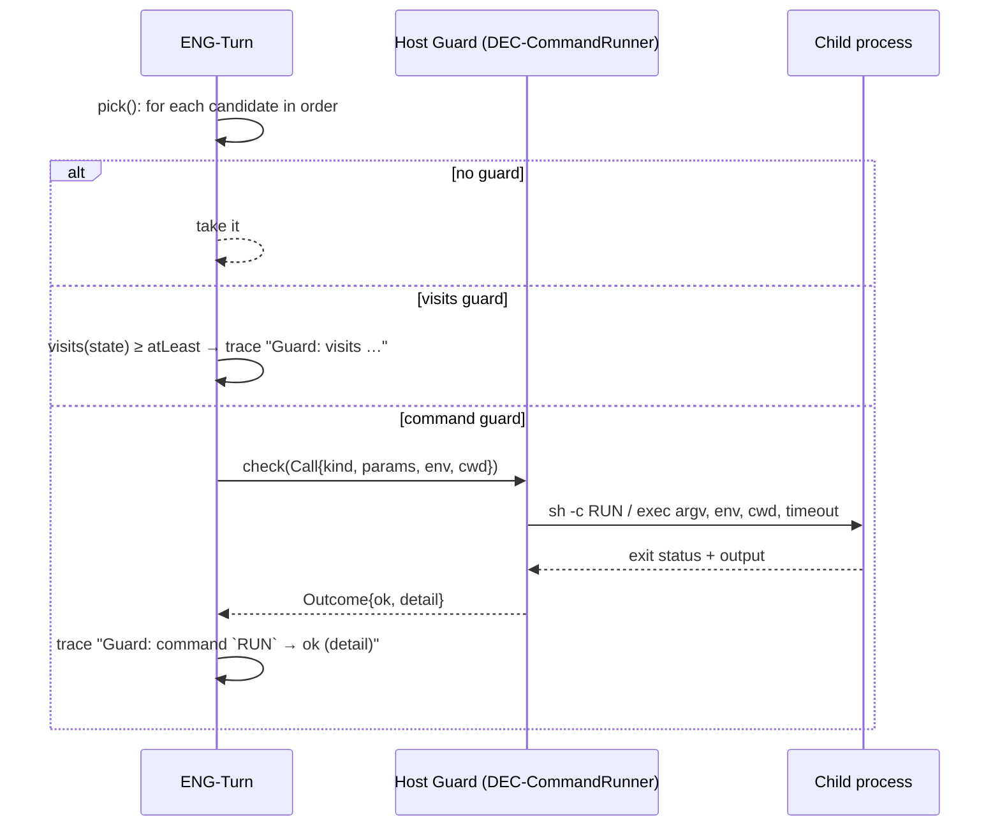
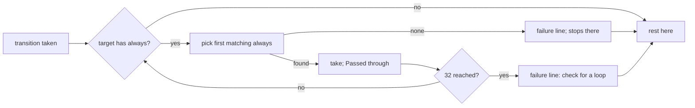

# Design Specification

## Overview

Branching is split between the core and the host. The core (ENG-Turn, DESIGN-ENG) evaluates guarded arrays in order, evaluates `visits` guards itself, follows `always` chains with a length cap, builds the command environment and records the trace. `command` guards and actions are `Host` kinds handed to the host's `Guard`/`Action` traits as a `Call`; the CLI host implements them in `DEC-CommandRunner`. The validator (`smllm-format`, CFG-Lower) rejects `always`-only loops and resolves `params.cwd` relative to the YAML file. Requirements: REQ-DEC-decisions.md.

## Architecture

AFFECTED LAYERS: smllm-core (ENG-Turn, ENG-Model), smllm-format (CFG-Lower), app host (DEC-CommandRunner)

### High-Level Architecture





### Module Organization

```
crates/lib/smllm-core/src/engine/turn.rs      pick, guard, env, settle (ENG-Turn)
crates/lib/smllm-core/src/model/action.rs     GuardDef, Value (ENG-Model)
crates/lib/smllm-format/src/lower/graph.rs    always-loop check (CFG-Lower)
crates/lib/smllm-format/src/lower/actions.rs  params.cwd resolved against the YAML dir
crates/app/smllm/src/host.rs                  DEC-CommandRunner (Commands, run_command)
```

### Architectural Decisions

- VISITS IN THE CORE, COMMANDS IN THE HOST: `visits` needs only instance data, so every host (including browsers) gets it; `command` needs processes, so it is a host kind reported by `Engine::unsupported` where missing (NFR-9)
- ENV ONLY, NEVER INTERPOLATION: machine text is never templated (CFG-17); the event's params reach commands as `SMLLM_PARAM_<SCREAMING_SNAKE>` (`issueId` → `SMLLM_PARAM_ISSUE_ID`), so LLM input cannot become shell syntax in array form and is only as dangerous as the author's own quoting in string form (NFR-5)
- ONE RUNNER FOR GUARDS AND ACTIONS: `Commands` implements both `Guard` and `Action` by calling `run_command` (ACT-4)
- CWD RESOLVED AT LOAD: `smllm-format` rewrites `params.cwd` to an absolute path from the YAML's directory; the runner uses it as is, else the session's `cwd` recorded at bind (`Call.cwd`)
- DRAINED PIPES: stdout and stderr are drained on threads so a chatty command cannot block before the timeout; `wait-timeout` enforces `timeoutSecs` and the child is killed on expiry
- TAIL ONLY ON FAILURE: the combined output is trimmed to its last 400 chars on one line and attached only to failures (`exited N: <tail>`); a passing guard's trace line has no detail
- ALWAYS CAP: `ALWAYS_CAP = 32`; the validator should make the cap unreachable (DEC-2_AC-2), the cap is a safety net for machines that skipped validation

## Components and Interfaces

### DEC-CommandRunner

The CLI host's command guard/action runner. String `run` → `sh -c` (`cmd /C` on Windows); non-empty list → exec with no shell; anything else → failure `no run param`. Sets cwd (`params.cwd`, else `Call.cwd` when non-empty), env from `Call.env`, stdin null. Exit 0 → `ok`; non-zero → `exited N[: tail]`; signal → `killed by a signal`; spawn error → `could not start: …`; timeout → `timed out after Ns`. The same file supplies the CLI's `InstructionSource` (reads files at request time, ENG-4), `Matcher` (`regex`), `Clock` and `Ids` (`getrandom`).

IMPLEMENTS: DEC-4_AC-1, DEC-5_AC-1, DEC-7_AC-1

```rust
pub const DEFAULT_TIMEOUT_SECS: u64 = 60;
pub struct Commands;
pub fn run_command(call: &Call<'_>) -> Outcome;
impl Guard for Commands { fn supports(&self, kind: &str) -> bool /* "command" */; fn check(&mut self, c: &Call<'_>) -> Outcome; }
impl Action for Commands { fn supports(&self, kind: &str) -> bool /* "command" */; fn run(&mut self, c: &Call<'_>) -> Outcome; }
pub struct Files;   // InstructionSource + Matcher + Clock
pub struct OsIds;   // Ids
```

The core side (guard evaluation, env, `always`) is ENG-Turn in DESIGN-ENG-engine.md; guard types are ENG-Model.

## Data Models

### Core Types

- COMMAND PARAMS: `run` (`Value::Str` shell, `Value::List` exec), `timeoutSecs` (`Value::Int`), `cwd` (`Value::Str`, absolute after lowering)
- ENVIRONMENT: `SMLLM_SESSION`, `SMLLM_MACHINE`, `SMLLM_STATE` (source state for guards and transition actions; the list's own state for entry/exit), `SMLLM_EVENT`, `SMLLM_INSTANCE`, `SMLLM_REF` (empty until set), `SMLLM_FROM`/`SMLLM_TO` (actions only), `SMLLM_PARAM_<NAME>`

```rust
// Trace lines (header and history):
// "Guard: visits WORK ≥ 3 → false (visits: 1)"
// "Guard: command `cargo test --quiet` → false (exit 1)"
// "Guard: command [cargo test] → true"
// "No always transition of CHECK matched; stopped there"
// "Stopped after 32 always transitions; check for a loop"
// history only: "Passed through: CHECK"; header: "Arrived by: accept from TRIAGE via CHECK"
```

## Correctness Properties

- ENG_P-1 (DESIGN-ENG): given the same guard results, branching is deterministic
  VALIDATES: NFR-3, DEC-1_AC-1
- ENG_P-4 (DESIGN-ENG): the session never rests in an `always` state
  VALIDATES: DEC-2_AC-1

## Error Handling

### Outcome details

- EXITED: `exited <code>` plus `: <tail>` when there was output
- SIGNAL: `killed by a signal`
- SPAWN: `could not start: <io error>`
- TIMEOUT: `timed out after <n>s`
- WAIT: `wait failed: <io error>`
- NO_RUN: `no run param`

### Strategy

PRINCIPLES:

- A guard that cannot run is false, never an error: the next candidate is tried
- If no candidate of an event matches, the call is rejected with nothing changed; if no `always` candidate matches, the instance stops in that state with a failure line (validation prevents this)

## Testing Strategy

### Property-Based Testing

- FRAMEWORK: proptest (see DESIGN-ENG)
- MINIMUM_ITERATIONS: 128
- TAG_FORMAT: @zen-test: ENG_P-n

Random `command` guard results per step exercise guarded arrays and the `CHECK` always state.

### Unit Testing

- AREAS: `host.rs` tests (shell with env, exit + tail, exec, spawn failure, timeout, missing run, cwd, tail trimming); core `env_name` and `describe`; `tests/engine.rs` guarded self re-entry, `visits` escalation, always routing by guard, `SMLLM_REF`/`SMLLM_TO`/`SMLLM_PARAM_*` in the recorded env

## Requirements Traceability

SOURCE: .zen/specs/REQ-DEC-decisions.md

- DEC-1_AC-1 → ENG-Turn (`pick`) (ENG_P-1)
- DEC-2_AC-1 → ENG-Turn (`settle`) (ENG_P-4)
- DEC-2_AC-2 → CFG-Lower (`graph.rs`)
- DEC-3_AC-1 → ENG-Model (`GuardDef`)
- DEC-4_AC-1 → DEC-CommandRunner
- DEC-5_AC-1 → DEC-CommandRunner — output tail kept only for failures
- DEC-6_AC-1 → ENG-Turn (`env`)
- DEC-7_AC-1 → DEC-CommandRunner; CFG-Lower resolves `params.cwd`; `Session.cwd` recorded at bind
- DEC-8_AC-1 → ENG-Turn (trace), ENG-Machine (`save` writes it to history) [partial] the header shows guard lines, `via` passed states and failures, but the output tail of a passing guard and of successful actions is not captured; no @zen-impl marker
- DEC-9_AC-1 → DEC-CommandRunner (exec form spawns the program directly); no marker

## Library Usage

### External Libraries

- wait-timeout (0.2): child process timeout
- regex (1.13): param `pattern` matching in the CLI host
- getrandom (0.4): session keys and instance ids

## Change Log

- 1.0.0 (2026-09-25): Initial design, documenting the P6 implementation
