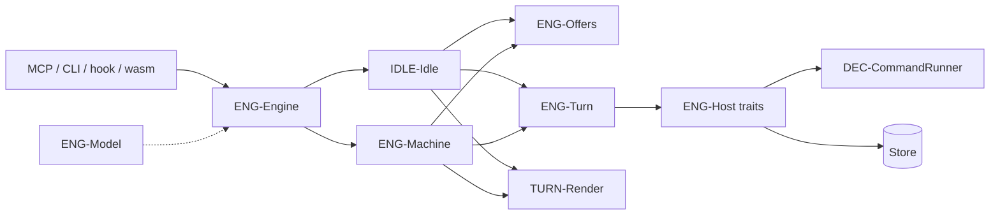
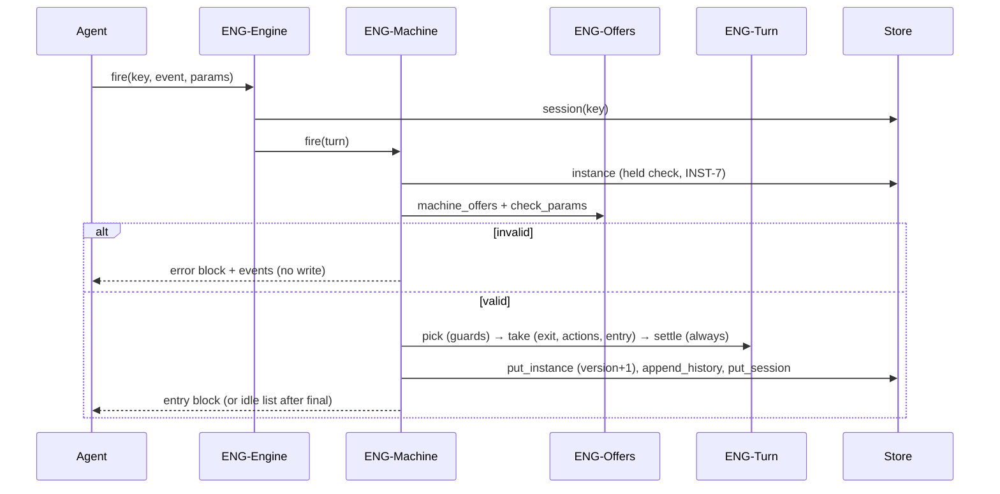

# Design Specification

## Overview

The engine lives in `smllm-core`, a `no_std` + `alloc` crate with no IO, time or randomness (NFR-1). It runs a validated, lowered model (`Config`, built by `smllm-format` or deserialised from `smllm compile` JSON) over a `Host` of trait objects the caller supplies. Every public call (`bind`, `view`, `menu`, `fire`, `stop`, `prompt_submitted`) loads the session from the store, builds a per-call `Turn`, dispatches to idle (DESIGN-IDLE) or the held machine state, and returns a `Reply` whose text is one `<smllm>` block (DESIGN-TURN). Requirements: REQ-ENG-engine.md; this document also owns the engine-wide correctness properties used by REQ-INST, REQ-IDLE, REQ-DEC, REQ-ACT and REQ-TURN.

## Architecture

AFFECTED LAYERS: smllm-core (engine, model, host traits, records, render), app host (CLI), smllm-wasm host

### High-Level Architecture

A call flows from a host surface (MCP tool, `smllm fire`, harness hook, wasm) into `ENG-Engine`, which picks idle or machine handling. Transitions run through `ENG-Turn`, which calls back into the host for command guards/actions and prompt files. The store is written only at the end of a successful call.





### Module Organization

```
crates/lib/smllm-core/src/
├── lib.rs              re-exports Engine, Bind, Reply, Stop, Offer, …
├── prelude.rs          alloc names for no_std
├── engine/
│   ├── api.rs          ENG-Engine: public protocol
│   ├── turn.rs         ENG-Turn: per-call state, guards, actions, visits, always
│   ├── offer.rs        ENG-Offers: offered events, param checks
│   ├── machine.rs      ENG-Machine: events inside a machine, save, commit
│   └── idle.rs         IDLE-Idle (DESIGN-IDLE)
├── host/
│   ├── traits.rs       ENG-Host: Store, Guard, Action, InstructionSource, Matcher, Clock, Ids, Host
│   └── memory.rs       ENG-Host: MemoryStore
├── model/              ENG-Model: Config, Machine, State, Transition, ActionDef, GuardDef
├── record/             INST-Records, STO-Records (DESIGN-INST)
├── render/             TURN-Render (DESIGN-TURN)
└── utils/              SmallMap, insertion_sort_by_key
crates/lib/smllm-core/tests/
├── support/mod.rs      fake host + hand-lowered `dev` and `help` machines
├── engine.rs           protocol tests + insta snapshots
├── properties.rs       proptest properties ENG_P-1..4
└── snapshots/
```

### Architectural Decisions

- NO_STD CORE WITH HOST TRAITS: `smllm-core` is `no_std` + `alloc`; IO, time and randomness come through `Store`, `Guard`, `Action`, `InstructionSource`, `Matcher`, `Clock` and `Ids`, bundled per call in a `Host` struct of `&mut dyn`/`&dyn` trait objects. Trait objects keep one monomorphised engine in the wasm and let the CLI, wasm and test hosts differ freely. Alternatives: generic `Engine<H: Host>` (code bloat per host), async traits
- SMALLMAP AND INSERTION SORT: string-keyed maps are a sorted `Vec` with binary search (`SmallMap`) and the only sort is a stable insertion sort; `BTreeMap` and std's sort pull large generic code into the wasm, and the engine's collections hold a handful of items. Alternatives: `BTreeMap`, `alloc` slice sort
- ONE FENCE PER REPLY: every reply, including a final state followed by the idle list, is exactly one `<smllm>` block (DESIGN-TURN). Alternatives: one block per logical part
- SETREF CHECKED BEFORE THE TRANSITION: when a picked transition carries `setRef`, the ref is validated (INST-3) before `take`, so a bad ref rejects the call with nothing run or saved. Alternatives: fail inside the action list (would leave a half-run transition)
- FAILED COMMANDS SKIP ONLY THEIR LIST'S COMMANDS: a failed command action skips the remaining commands of the same action list; prompts in that list are still gathered and later lists still run. This is the reading of ACT-3 ("skips the rest of its list") that keeps instructions visible to the agent. Alternatives: skip the whole list including prompts; abort all later lists
- OPTIMISTIC INSTANCE VERSIONS: each write carries `version = stored + 1`; the store rejects anything else with `HostError::Conflict`, and the loser drops to idle (INST-8). Commands have already run by then; only the persisted state is protected. Alternatives: lock for the whole call (holds the lock across long commands)
- ONE SUSPENDED SLOT PER SESSION: `Session.suspended` holds one instance; a second `unmatched` to idle parks the older suspended instance with a header note. Alternatives: a stack of suspended instances
- READ-ONLY VIEW RE-RENDERS PROMPTS ONLY: `view` shows the state's entry prompt actions (shared before, own, shared after) without running commands or counting a visit (ENG-5)
- PER-CALL CONFIG IN THE APP: the CLI host builds a fresh `Engine` from the config files on every hook/tool call, so ENG-4's "YAML edits need a reload" is satisfied trivially

## Components and Interfaces

### ENG-Model

The validated, lowered model. Plain data with optional `serde` (for `smllm compile` JSON). Guards and actions are XState `{type, params}`; `visits` and `prompt`/`setRef` are core-evaluated, anything else is a `Host` kind resolved through the host traits (NFR-9). `Prompt::DefaultFile` is the implied `enter-<STATE>.md`, silently skipped when absent.

IMPLEMENTS: DEC-3_AC-1

```rust
pub struct Config { pub machines: Vec<Machine>, pub idle: Vec<ActionDef> }
pub struct Machine {
    pub id: String, pub description: Option<String>, pub initial: String,
    pub instance: InstanceSpec, pub events: SmallMap<EventDef>,
    pub shared: Vec<SharedAction>, pub states: Vec<State>,
}
pub struct State {
    pub name: String, pub is_final: bool, pub entry_point: bool, pub fallback: bool,
    pub entry: Vec<ActionDef>, pub exit: Vec<ActionDef>, pub on: Vec<On>,
    pub always: Vec<Transition>, pub param_descriptions: SmallMap<SmallMap<String>>, /* … */
}
pub struct Transition {
    pub target: Option<String>, pub guard: Option<GuardDef>, pub actions: Vec<ActionDef>,
    pub reenter: bool, pub description: Option<String>,
}
pub enum GuardDef { Visits { state: String, at_least: u32 }, Host { kind: String, params: SmallMap<Value> } }
pub enum ActionDef { Prompt(Prompt), SetRef, Host { kind: String, params: SmallMap<Value> } }
pub enum Prompt { Text(String), File(String), DefaultFile(String) }
pub enum Value { Str(String), Int(i64), Bool(bool), List(Vec<String>) }
```

### ENG-Host

What a host supplies, borrowed for one call. `MemoryStore` is the in-memory `Store` used by tests and by `smllm-wasm` (which persists a JSON snapshot). `put_instance` enforces the version rule; the app's file store (STO-FileStore) does the same under a lock (DESIGN-INST).

```rust
pub trait Store {
    fn session(&mut self, key: &str) -> Result<Option<Session>, HostError>;
    fn put_session(&mut self, s: &Session) -> Result<(), HostError>;
    fn binding(&mut self, harness: &str, host_session: &str) -> Result<Option<String>, HostError>;
    fn put_binding(&mut self, harness: &str, host_session: &str, key: &str) -> Result<(), HostError>;
    fn instance(&mut self, machine: &str, id: &str) -> Result<Option<Instance>, HostError>;
    fn instances(&mut self, machine: &str) -> Result<Vec<Instance>, HostError>;
    /// version must be stored+1 (or 1 when new), else HostError::Conflict.
    fn put_instance(&mut self, i: &Instance) -> Result<(), HostError>;
    fn append_history(&mut self, machine: &str, id: &str, e: &HistoryEntry) -> Result<(), HostError>;
}
pub trait Guard { fn supports(&self, kind: &str) -> bool; fn check(&mut self, c: &Call<'_>) -> Outcome; }
pub trait Action { fn supports(&self, kind: &str) -> bool; fn run(&mut self, c: &Call<'_>) -> Outcome; }
pub trait InstructionSource { fn read(&self, file: &str) -> Result<Option<String>, String>; }
pub trait Matcher { fn is_match(&self, pattern: &str, value: &str) -> Result<bool, String>; }
pub trait Clock { fn now_ms(&self) -> u64; }
pub trait Ids { fn random(&mut self) -> u64; }
pub struct Call<'a> { pub machine: &'a str, pub kind: &'a str, pub params: &'a SmallMap<Value>,
                      pub env: &'a [(String, String)], pub cwd: &'a str }
pub struct Outcome { pub ok: bool, pub detail: String }
pub struct Host<'a> {
    pub store: &'a mut dyn Store, pub guards: &'a mut dyn Guard, pub actions: &'a mut dyn Action,
    pub source: &'a dyn InstructionSource, pub matcher: &'a dyn Matcher,
    pub clock: &'a dyn Clock, pub ids: &'a mut dyn Ids,
}
```

### ENG-Engine

The public protocol (HOST-1). `bind` reuses a harness binding or creates a session in idle (key `sm-` + 6 Crockford base32 chars from `Ids`); `view` and `menu` are read-only; `fire` dispatches to idle or machine handling and, with no key, only `enter` creates a session; `stop` returns `Allow` for unknown, idle or yielded sessions, `Runaway` when `stop_hook_active`, else `Block` with the menu; `prompt_submitted` clears `yielded`. `unsupported` walks every guard/action (shared, entry, exit, transitions, always) and lists host kinds the given `Guard`/`Action` do not support.

IMPLEMENTS: ENG-5_AC-1, ACT-6_AC-1, NFR-9_AC-1, HOST-3_AC-1, HOST-4_AC-1, TURN-4_AC-1, TURN-5_AC-1, TURN-6_AC-1, TURN-8_AC-1

```rust
impl Engine {
    pub fn new(config: Config) -> Self;
    pub fn config(&self) -> &Config;
    pub fn unsupported(&self, guards: &dyn Guard, actions: &dyn Action) -> Vec<String>;
    pub fn bind(&self, host: &mut Host<'_>, bind: &Bind<'_>) -> Result<Reply, Error>;
    pub fn view(&self, host: &mut Host<'_>, key: &str) -> Result<Reply, Error>;
    pub fn menu(&self, host: &mut Host<'_>, key: &str) -> Result<Reply, Error>;
    pub fn fire(&self, host: &mut Host<'_>, key: Option<&str>, event: &str,
                params: &[(String, String)], bind: &Bind<'_>) -> Result<Reply, Error>;
    pub fn stop(&self, host: &mut Host<'_>, key: &str, stop_hook_active: bool) -> Result<Stop, Error>;
    pub fn prompt_submitted(&self, host: &mut Host<'_>, key: &str) -> Result<(), Error>;
}
pub struct Bind<'s> { pub harness: &'s str, pub host_session: Option<&'s str>,
                      pub cwd: &'s str, pub configs: &'s [String] }
pub struct Reply { pub ok: bool, pub session: String, pub location: Location, pub text: String }
pub enum Stop { Allow, Block(String), Runaway(String) }
```

### ENG-Turn

Working state for one call: session copy, `now`, event, checked params, and the header parts gathered while transitioning (`notes`, `trace`, `passed`, `failures`, `prompts`). `pick` evaluates a guarded array in order (DEC-1), writing one `Guard:` trace line per evaluated guard. `take` decides external vs internal (target set and (≠ source or `reenter`)): external runs `exit` → `actions` → `enter`; internal runs only `actions` (ACT-1). `enter` sets the state, increments its visit, then runs shared-before, own and shared-after `entry` lists (CFG-11); `exit` mirrors it. `run` executes one list (DESIGN-ACT). `settle` follows `always` transitions up to `ALWAYS_CAP = 32`, recording each passed state; no match or the cap adds a failure line (DEC-2). `env` builds the DEC-6 environment (params as `SMLLM_PARAM_<SCREAMING_SNAKE>`), adding `SMLLM_FROM`/`SMLLM_TO` for actions.

IMPLEMENTS: DEC-1_AC-1, DEC-2_AC-1, DEC-6_AC-1, ENG-3_AC-1, ACT-1_AC-1, ACT-2_AC-1, ACT-3_AC-1, CFG-3_AC-1, CFG-11_AC-1

```rust
pub(crate) const ALWAYS_CAP: usize = 32;
pub(crate) struct Turn<'a, 'h> {
    pub config: &'a Config, pub host: &'a mut Host<'h>, pub session: Session, pub now: u64,
    pub event: String, pub params: Vec<(String, String)>,
    pub notes: Vec<String>, pub trace: Vec<String>, pub passed: Vec<String>,
    pub failures: Vec<String>, pub prompts: Vec<String>,
}
impl Turn<'_, '_> {
    fn env(&self, inst: &Instance, state: &str, from: Option<&str>, to: Option<&str>) -> Vec<(String, String)>;
    fn pick<'t>(&mut self, inst: &Instance, state: &str, candidates: &'t [Transition]) -> Option<&'t Transition>;
    fn run(&mut self, inst: &mut Instance, list: &[ActionDef], label: &ListLabel<'_>);
    fn enter(&mut self, m: &Machine, inst: &mut Instance, name: &str, from: Option<&str>);
    fn exit(&mut self, m: &Machine, inst: &mut Instance, name: &str, to: Option<&str>);
    fn take(&mut self, m: &Machine, inst: &mut Instance, source: &str, t: &Transition);
    fn settle(&mut self, m: &Machine, inst: &mut Instance);
}
```

### ENG-Offers

Builds the offered events and checks calls against them. In a machine state: each `on` event (guidance = first transition `description`, else `meta.events` description; param prompt = `meta.paramDescriptions`, else the param's description), then `resume` (fallback state with an interrupted state), `yield` (with an optional `note` param), `park`, `unmatched`; none in a final state; only `park` and `unmatched` when the saved state is missing (IDLE-3). Built-in guidance takes the machine's override when present (IDLE-1). `idle_offers` is in DESIGN-IDLE. `check_params` rejects unknown params, missing required ones, values outside `enum`, and values failing `pattern` (via `Matcher`), returning params in declaration order.

IMPLEMENTS: ENG-1_AC-1, IDLE-1_AC-1, TURN-3_AC-1

```rust
pub const BUILTINS: [&str; 5] = ["enter", "resume", "park", "unmatched", "yield"];
pub struct Offer { pub name: String, pub description: Option<String>, pub params: Vec<ParamView> }
pub struct ParamView { pub name: String, pub required: bool, pub enum_values: Vec<String>,
                       pub pattern: Option<String>, pub description: Option<String> }
pub(crate) fn machine_offers(m: &Machine, state: Option<&State>, inst: &Instance) -> Vec<Offer>;
pub(crate) fn idle_offers(config: &Config, suspended: Option<(&Machine, &Instance)>) -> Vec<Offer>;
pub(crate) fn check_params(offer: &Offer, given: &[(String, String)], m: &dyn Matcher)
    -> Result<Vec<(String, String)>, String>;
```

### ENG-Machine

Events fired while holding an instance. `held(turn, persist)` loads the instance and confirms this session holds it and it is active. Otherwise it returns `Gone`: `Unconfigured` when the machine is missing from the (current) config — reported, never saved, so a briefly invalid file cannot lose the session's place; `Moved` when another session holds it or it is not active/present — the session drops to idle in the store only when `persist` (event calls and the stop hook). Views never write (ENG-5). `Engine::stop` uses `held(persist)`: a moved instance is reported once as the block reason and the session goes idle (INST-7); an unconfigured machine lets the agent stop. `fire` checks offer + params (reject → error block, nothing written), then: `yield` sets `session.yielded`, bumps the version and appends history, replying with a `Yielded:` block; `park` runs exit, parks, goes idle; `unmatched` goes to the fallback state or suspends (IDLE-2); `resume` (in a fallback state) exits it and re-enters the interrupted state; any other event checks `setRef` first when any of its transitions sets the ref (INST-3; before guards run, so a rejected call has no side effects), picks a transition (none → reject), clears `interrupted` when a targeted transition leaves a fallback state, then `take` + `settle` + `commit`. `commit` completes the instance on a final state (IDLE-5), clears `yielded`, bumps the version and calls `save`, which writes instance → history (notes, `Passed through:`, guard trace, failures) → session; a store `Conflict` turns into `moved`.

IMPLEMENTS: ENG-2_AC-1, INST-3_AC-1, INST-6_AC-1, INST-7_AC-1, INST-8_AC-1, IDLE-2_AC-1, IDLE-5_AC-1

```rust
pub(crate) enum Gone { Unconfigured(Box<Reply>), Moved(Box<Reply>) }
pub(crate) fn held<'c>(turn: &mut Turn<'c, '_>, persist: bool) -> Result<Result<(&'c Machine, Instance), Gone>, Error>;
pub(crate) fn moved(turn: &mut Turn<'_, '_>, msg: String) -> Result<Reply, Error>;
pub(crate) fn view(turn: &mut Turn<'_, '_>, entry: bool) -> Result<Reply, Error>;
pub(crate) fn fire(turn: &mut Turn<'_, '_>, params: &[(String, String)]) -> Result<Reply, Error>;
pub(crate) fn save(turn: &mut Turn<'_, '_>, m: &Machine, inst: &mut Instance,
                   from: Option<&str>, to: Option<&str>) -> Result<Result<(), Reply>, Error>;
pub(crate) fn commit(turn: &mut Turn<'_, '_>, m: &Machine, inst: Instance,
                     from: Option<&str>, arrived: String) -> Result<Reply, Error>;
pub(crate) fn takeover_note(turn: &mut Turn<'_, '_>, holder: &str) -> Result<String, Error>;
```

## Data Models

### Core Types

- LOCATION: where the session is after a call; all `None` in idle

```rust
pub struct Location { pub machine: Option<String>, pub state: Option<String>,
                      pub instance: Option<String>, pub r#ref: Option<String> }
```

- SMALLMAP: sorted-vector string map, serialised as a JSON object

```rust
pub struct SmallMap<V> { entries: Vec<(String, V)> }
impl<V> SmallMap<V> { pub fn get(&self, k: &str) -> Option<&V>; pub fn insert(&mut self, k: impl Into<String>, v: V) -> Option<V>; /* … */ }
```

Records (`Session`, `Instance`, `HistoryEntry`) are in DESIGN-INST-instances.md.

## Correctness Properties

- ENG_P-1 [Determinism]: Running the same event sequence (events, params, guard results) from the same store twice yields identical reply texts and identical stores
  VALIDATES: NFR-3, ENG-2

- ENG_P-2 [Invalid Call Is Inert]: Every call answered with `ok: false` leaves the store exactly as it was before the call
  VALIDATES: TURN-3_AC-1

- ENG_P-3 [Monotonic Counters]: For every instance, each state's visit count and the instance version never decrease across calls
  VALIDATES: ENG-3_AC-1, INST-8_AC-1

- ENG_P-4 [Never Rest In Always]: After every call, the state the session is located in has no `always` transitions
  VALIDATES: DEC-2_AC-1

## Error Handling

### Error

A call that could not be served (as opposed to a rejected event, which is a `Reply` with `ok: false`).

- UNKNOWN_SESSION: no session has this key; message tells the agent to pass the header key or fire `enter` with no session (HOST-3)
- MISSING_SESSION: no key and the event is not `enter`
- HOST: a `HostError::Other` from the store

### HostError

- CONFLICT: the instance version was not stored+1 (INST-8); the engine converts it into a `moved` reply, never an `Error`
- OTHER: any other store failure, as a message

### Strategy

PRINCIPLES:

- Rejected events are replies, not errors: header, `error:` line, events list, `ok: false`, nothing written
- Validate everything (offer, params, entry point, ref) before running any action
- Actions and prompt files never fail a call; they add `Action failed:` / `Prompt failed:` lines (ACT-3)
- A lost version race or a missing/moved instance drops the session to idle with an `error:` in the idle list

## Testing Strategy

### Property-Based Testing

- FRAMEWORK: proptest (dev-dependency)
- MINIMUM_ITERATIONS: 128
- TAG_FORMAT: @zen-test: ENG_P-n

Random sequences of up to 25 steps over all built-ins, the test machines' events and a bogus event, with random params (valid and invalid values) and random `command` guard results, driven through the fake host in `tests/support`.

```rust
// @zen-test: ENG_P-1
#[test]
fn deterministic(steps in proptest::collection::vec(step(), 0..25)) {
    prop_assert_eq!(run(&steps), run(&steps));
}
```

```rust
// @zen-test: ENG_P-2
// @zen-test: ENG_P-3
// @zen-test: ENG_P-4
#[test]
fn invariants_hold(steps in proptest::collection::vec(step(), 0..25)) {
    // per step: !ok ⇒ store unchanged; location state has no `always`;
    // visits and version of every existing instance never go down
}
```

### Unit Testing

In-module tests for pure helpers; protocol tests in `tests/engine.rs` through a fake host (`Fake`: `MemoryStore`, scripted guard results by `run` string, failing actions, recorded action calls with env, in-memory prompt files, fixed clock, counting ids) and hand-lowered `dev` (the plan §3 example) and `help` (fallback state) machines.

- AREAS: env naming (`issueId` → `ISSUE_ID`), guard description in traces, SmallMap, insertion sort, header/quote/UTC formatting, bind/rebind, enter/setRef/guards/always/final, park/enter/jump, takeover and moved, detour via idle and fallback, read-only view, failed actions, reopen, missing-state repair, idle rejections, unknown sessions, unsupported kinds

### Integration Testing

Agent text is snapshot-tested with `insta` (`tests/snapshots/engine__*.snap`); the app's scripted sessions (`crates/app/smllm/tests/session.rs`) drive hooks, `fire` and MCP over the real file store and command runner.

- SCENARIOS: idle list on bind, new instance entry, arrival in WORK, guarded self re-entry, final + idle list, stop-hook menu, read-only view, error block

## Requirements Traceability

SOURCE: .zen/specs/REQ-ENG-engine.md

- ENG-1_AC-1 → ENG-Offers
- ENG-2_AC-1 → ENG-Machine (ENG_P-1)
- ENG-3_AC-1 → ENG-Turn (ENG_P-3)
- ENG-4_AC-1 → ENG-Host InstructionSource read on every render; app reloads config per call; no @zen-impl marker
- ENG-5_AC-1 → ENG-Engine

## Library Usage

### Framework Features

- ALLOC: `String`, `Vec`, `format!` via `prelude.rs`
- SERDE FEATURE: optional derives on model and records for `smllm compile` JSON and stores

### External Libraries

- serde (1, optional, no default features): model/record (de)serialisation
- proptest (1.11, dev): property tests
- insta (1.47, dev): snapshot tests

## Change Log

- 1.0.0 (2026-09-25): Initial design, documenting the P3 implementation
