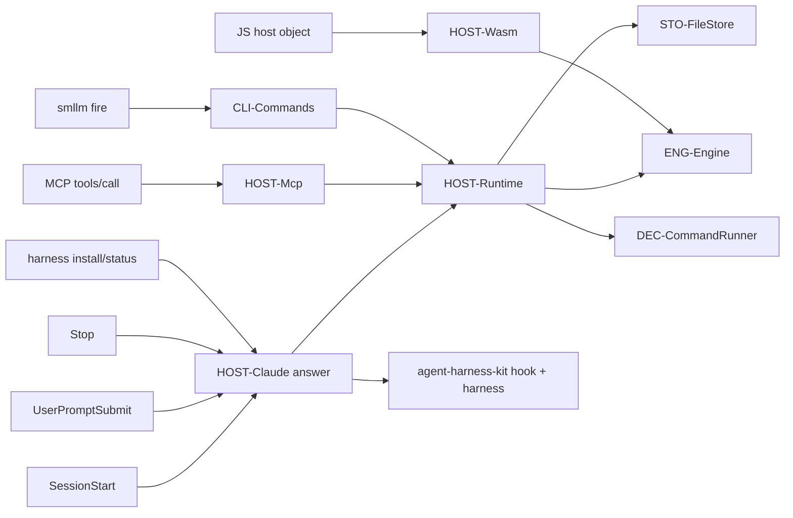

# Design Specification

## Overview

Implements REQ-HOST. Every surface (Claude Code hooks, the MCP server, `smllm fire`, the wasm `Engine`) builds a `Host` and calls the core protocol in `smllm-core` (ENG-Engine). In the binary, `HOST-Runtime` does the wiring per call: load configs (by lookup for a new session, or the ones recorded on an existing session), build the engine and an `FsStore`, and supply the command host. `HOST-Claude` adapts Claude Code's hook JSON through `agent-harness-kit` and declares smllm's harness parts as a kit `Tool`. `HOST-Mcp` is an `rmcp` stdio server with one hand-built tool. `HOST-Wasm` exposes the same protocol to JavaScript. The core parts of HOST-1..4 (protocol, key generation, bind, keyless `enter`) live in ENG-Engine and are specified with the engine.

## Architecture

AFFECTED LAYERS: smllm app (runtime, commands/harness, commands/mcp), smllm-wasm, agent-harness-kit, Claude Code plugin

### High-Level Architecture



### Module Organization

```
crates/app/smllm/src/
├── runtime.rs              # HOST-Runtime
└── commands/
    ├── harness.rs          # HOST-Claude: Tool impl, hook answers, install/status
    └── mcp.rs              # HOST-Mcp: rmcp ServerHandler, one tool
crates/lib/smllm-wasm/src/lib.rs   # HOST-Wasm
crates/lib/agent-harness-kit/src/
├── harness/                # install/status, parts, region, merge, target, record, declined
└── hook/                   # HookInput, Answer, emit, LoopGuard
plugin/                     # Claude Code plugin (hooks.json, .mcp.json, plugin.json)
.claude-plugin/marketplace.json
```

### Architectural Decisions

- RMCP OVER HAND-ROLLED MCP: user decision in P1; `rmcp` tracks protocol versions and capabilities. Cost: a current-thread `tokio` runtime used only by `smllm mcp`. Alternatives: hand-rolled JSON-RPC over stdio (no async runtime)
- ONE HAND-BUILT TOOL SCHEMA: the input schema is a literal JSON object (`params` = object of strings, CFG-16) rather than derived via rmcp macros, so it stays a stable contract. Alternatives: `#[tool]` macro with a schemars-derived struct
- ENGINE CALLS OFF THE ASYNC RUNTIME: `spawn_blocking`, since guards and actions may run commands for minutes. Alternatives: async command runner
- SESSION-BOUND CONFIGS: `Runtime::for_session` loads the configs recorded on the session (STO-2), not the caller's lookup, so MCP calls from any cwd act on the right machines
- BINDING PER HARNESS SESSION ID: the Claude hook looks up `bindings/claude/<session_id>`; no binding → bind a new session (HOST-4). The MCP server has no harness session id, so the agent passes the key it saw in the header (D5)
- RUNAWAY GUARD FROM `stop_hook_active`: the kit's `LoopGuard` (sokf's same-text hash) is not used by the Claude hook; the core's `Stop::Runaway` covers TURN-6
- KIT'S `query` MODULE NOT PORTED: it needs `jmespath`, an unapproved dependency, and smllm does not use it. Alternatives: port behind a feature once approved
- PLUGIN IN ADDITION TO INSTALL PARTS (D34): the plugin wires hooks and MCP only; the instructions block and permissions stay with `harness install`
- USER-SCOPE MCP THROUGH THE `claude` CLI: `~/.claude.json` is Claude Code's internal state file, so it is only observed, never written

## Components and Interfaces

### HOST-Runtime

Per-call wiring. `new` loads configs with `smllm_format::load_configs`, maps each machine id to its `state_dir`, builds `Engine` and `FsStore` (user state dir), and remembers the config paths for new sessions. `lookup` resolves configs from a cwd (CLI-Lookup). `for_session` reads the session with a machine-less store and reloads its recorded configs; an unknown key yields an empty config and the engine reports the unknown session. `with` builds a `Host` from `FsStore`, `Commands` (guards and actions), `Files` (prompt files, regex matcher, clock) and `OsIds`.

```rust
pub struct Runtime {
    pub loaded: Loaded,
    pub engine: Engine,
    pub store: FsStore,
    pub configs: Vec<String>,
}

impl Runtime {
    pub fn new(files: &[ConfigFile]) -> Result<Self>;
    pub fn lookup(explicit: Option<&Path>, cwd: &Path) -> Result<Self>;
    pub fn for_session(key: &str) -> Result<Self>;
    pub fn with<R>(&mut self, f: impl FnOnce(&Engine, &mut Host<'_>) -> R) -> R;
    pub fn bind(&mut self, harness: &str, host_session: Option<&str>, cwd: &str) -> Result<Reply>;
}
```

### HOST-Claude

Hooks: `hook` reads stdin into `HookInput::parse` (bad JSON = empty input), calls `answer`, and writes through the kit's `emit` (answer JSON on stdout and exit 0; failure → `error:` on stderr, empty stdout, exit 1). An unknown harness name exits 2. `answer` resolves the bound key from `bindings/claude/<session_id>`:

- `session-start`: bound and stored → `view` (entry block); else lookup configs from the input `cwd` (none → `{}`), `bind("claude", session_id, cwd)`; the reply text goes out as `hookSpecificOutput.additionalContext`
- `user-prompt-submit`: bound → `prompt_submitted` (clear yield); always `{}`
- `stop`: unbound → `{}`; else `stop(key, stop_hook_active)` → `Allow` = `{}`, `Block(text)` = `{"decision":"block","reason":text}`, `Runaway(text)` = `{}` with the list on stderr

Install/status: `Smllm` implements the kit's `Tool`; `run` parses the scope and calls `install` or `status`, printing text or `--json`. The project root is the directory holding `.smllm/` (else cwd); the user root is `~/.claude`. Parts per scope:

- `instructions`: region part with `INSTRUCTIONS_BLOCK`; the kit picks `AGENTS.md`/`CLAUDE.md` (HOST-10) and applies the `<!-- smllm:harness -->` region rules (HOST-11)
- `mcp`: project → merge `mcpServers.smllm = {command: "smllm", args: ["mcp"]}` into `.mcp.json`; user → external part `ClaudeMcpUser` (write = `claude mcp remove` then `claude mcp add-json --scope user smllm <json>`; observe = read `/mcpServers/smllm` from `~/.claude.json`). The kit writes external parts before any file, so a failing `claude mcp` leaves every file as found (NFR-6); files are written atomically (temp + rename)
- `hooks`: merge into `.claude/settings.json` / `~/.claude/settings.json`: one own group per event (`SessionStart`, `UserPromptSubmit`, `Stop`) keyed by the command prefix `smllm harness hook `
- `permissions`: add `mcp__smllm__smllm` to `permissions.allow` in the same settings file

Record: `.smllm/harness.toml` or `~/.config/smllm/harness.toml`. Declined parts (`--without`): `[harness.claude] without = [...]` in `.smllm/config.toml` or `~/.config/smllm/config.toml` via the kit's `TomlDeclined`, edited in place.

IMPLEMENTS: HOST-11_AC-1, HOST-6_AC-1, CLI-7_AC-1, HOST-7_AC-1, HOST-8_AC-1, CLI-8_AC-1

```rust
pub const INSTRUCTIONS_BLOCK: &str;

pub struct Smllm { /* project, claude_user, user_config: PathBuf */ }
impl Smllm { pub fn new(cwd: &Path) -> Result<Self>; }
impl agent_harness_kit::Tool for Smllm {
    fn name(&self) -> &str;                                   // "smllm"
    fn profile(&self, harness: &str, scope: Scope) -> Option<Profile>; // "claude" only
    fn root(&self, scope: Scope) -> agent_harness_kit::Result<PathBuf>;
    fn record_path(&self, scope: Scope) -> agent_harness_kit::Result<PathBuf>;
    fn declined_store(&self, scope: Scope) -> agent_harness_kit::Result<Box<dyn DeclinedStore + '_>>;
}

pub fn run(args: &HarnessArgs, installing: bool) -> Result<u8>;
pub fn answer(hook: &str, input: &HookInput) -> Result<Answer>;
pub fn hook(args: &HookArgs) -> Result<u8>;
```

### HOST-Mcp

`serve` builds a current-thread tokio runtime and serves `Server` over `rmcp::transport::stdio()`. `get_info` enables tools and sets `AGENT_RULES` as server instructions. `list_tools` returns one `Tool` named `smllm` with `description()` (AGENT_RULES plus call shapes) and `input_schema()` (`session` optional string — omitted only for a keyless `enter`, HOST-3; `event` optional string; `params` object with string values). `call_tool` rejects other names with `invalid_params`, then runs `call` in `spawn_blocking`. `call` validates argument types (non-string param → "param X must be a string"), picks `Runtime::for_session(key)` (or lookup from the server's cwd when keyless), then `view` when there is no event, else `fire` with a `Bind { harness: "mcp" }` for keyless `enter`. A rejected event or error returns `isError: true` with the text.

IMPLEMENTS: HOST-12_AC-1, CFG-16_AC-1, CLI-9_AC-1

```rust
pub const TOOL: &str = "smllm";
pub fn description() -> String;
pub fn input_schema() -> serde_json::Map<String, serde_json::Value>;
pub fn call(args: &Map<String, Value>, cwd: &Path, explicit: Option<&Path>) -> (bool, String);
pub fn serve(explicit: Option<&Path>) -> Result<u8>;

impl rmcp::ServerHandler for Server {
    fn get_info(&self) -> ServerConfig;
    async fn list_tools(&self, _: Option<PaginatedRequestParams>, _: RequestContext<RoleServer>)
        -> Result<ListToolsResult, ErrorData>;
    async fn call_tool(&self, request: CallToolRequestParams, _: RequestContext<RoleServer>)
        -> Result<CallToolResponse, ErrorData>;
}
```

### HOST-Wasm

`wasm_bindgen` `Engine` class over `smllm compile` JSON with a `MemoryStore`. One JS host object supplies every host trait: `supports`, `check`, `run` (`""` = success), `read`, `isMatch`, `now`, `random`; params and env cross as JSON strings. Every method returns the core `Reply` as JSON; `stop` returns `null` or the list text; `exportState` / `importState` move the store as JSON so a JS host can persist it. `unsupported()` lists guard/action kinds the host cannot run (NFR-9).

```rust
#[wasm_bindgen]
impl Engine {
    #[wasm_bindgen(constructor)]
    pub fn new(compiled: &str, host: JsHost) -> Result<Engine, JsError>;
    pub fn unsupported(&mut self) -> String;
    pub fn bind(&mut self, harness: &str, host_session: Option<String>, cwd: &str) -> Result<String, JsError>;
    pub fn view(&mut self, key: &str) -> Result<String, JsError>;
    pub fn events(&mut self, key: &str) -> Result<String, JsError>;
    pub fn fire(&mut self, key: Option<String>, event: &str, params: &str) -> Result<String, JsError>;
    pub fn stop(&mut self, key: &str, stop_hook_active: bool) -> Result<Option<String>, JsError>;
    #[wasm_bindgen(js_name = promptSubmitted)]
    pub fn prompt_submitted(&mut self, key: &str) -> Result<(), JsError>;
    #[wasm_bindgen(js_name = exportState)]
    pub fn export_state(&self) -> String;
    #[wasm_bindgen(js_name = importState)]
    pub fn import_state(&mut self, state: &str) -> Result<(), JsError>;
}
```

## Data Models

### Core Types

- ANSWER: the kit's Claude Code hook answer

```rust
pub enum Answer {
    Allow { stderr: Option<String> },         // {}
    Block { reason: String },                 // {"decision":"block","reason":…}
    Context { event: String, context: String }, // hookSpecificOutput.additionalContext
}
```

- HOOK_INPUT: every field optional, unknown fields ignored

```rust
pub struct HookInput {
    pub session_id: Option<String>, pub transcript_path: Option<String>, pub cwd: Option<String>,
    pub hook_event_name: Option<String>, pub source: Option<String>,
    pub prompt: Option<String>, pub stop_hook_active: Option<bool>,
}
```

### Entities

### Claude Code plugin
`plugin/` with `.claude-plugin/plugin.json`, `hooks/hooks.json` (the three `smllm harness hook claude <HOOK>` commands), `.mcp.json` (`smllm mcp`); listed by `.claude-plugin/marketplace.json` (`source: ./plugin`)
- VERSION (string, required): kept equal to the workspace version

## Correctness Properties

- HOST_P-1 [Hook output shape]: a hook either exits 0 with exactly one JSON object line on stdout, or exits 1 with empty stdout and `error:` on stderr
  VALIDATES: HOST-7_AC-1, NFR-4
- HOST_P-2 [Install idempotent]: a second `harness install` with the same options writes nothing and reports every part current
  VALIDATES: HOST-6_AC-1, HOST-11_AC-1
- HOST_P-3 [Region isolation]: installing changes only the text between smllm's markers
  VALIDATES: HOST-11_AC-1

## Error Handling

### Hook failures

- UNKNOWN HOOK: `error: no hook named …` on stderr, exit 1
- UNKNOWN HARNESS: `error: no harness named …`, exit 1 (a failed hook, HOST-7)
- STORE OR ENGINE ERROR: exit 1, stderr only

### MCP call failures

- BAD ARGUMENT TYPE: tool result `isError`, text `error: … must be a string`
- UNKNOWN TOOL: JSON-RPC `invalid_params` error
- REJECTED EVENT: tool result `isError` with the error block and events list

### Strategy

PRINCIPLES:

- A hook never blocks on its own failure; the agent can always stop
- `harness install` refuses before any write when a part is edited (without `--force`) or the declined store is unreadable
- Tool errors are returned as tool results, so the agent sees them

## Testing Strategy

### Property-Based Testing

- FRAMEWORK: proptest
- MINIMUM_ITERATIONS: 64
- TAG_FORMAT: @zen-test: HOST_P-{n}

The kit's `tests/properties_harness.rs` covers HOST_P-2 and HOST_P-3 (idempotent install, region isolation, merges keep the rest, refusal writes nothing) without `@zen-test` markers.

### Unit Testing

- AREAS: kit `Answer` JSON forms, region/merge/target selection, declined store

### Integration Testing

`crates/app/smllm/tests/session.rs` drives the real binary as a fake agent; `tests/cli.rs` covers install/status.

- SCENARIOS: hooks + `fire` through the showcase (idle stop, block until yield, runaway, prompt clears yield, takeover, moved), no-config silent hooks, keyless `fire enter`, MCP over stdio (initialize, tools/list, calls, type errors, unknown key, unknown tool), `harness install|status` project scope incl. `AGENTS.md` target and `--without mcp`

## Requirements Traceability

SOURCE: .zen/specs/REQ-HOST-harnesses.md

- HOST-1_AC-1 → ENG-Engine — core `bind`/`view`/`menu`/`fire`; used by HOST-Runtime and HOST-Wasm; no marker
- HOST-2_AC-1 → ENG-Engine — `sm-` + 6 random chars, retried until unused; no marker
- HOST-3_AC-1 → ENG-Engine — keyless `enter` via HOST-Mcp and `smllm fire`; tested in session.rs without HOST marker
- HOST-4_AC-1 → ENG-Engine — binding reuse in `bind`; new id → new key tested in session.rs without marker
- HOST-5_AC-1 → HOST-Mcp — and CLI-Commands `fire`; no marker
- HOST-6_AC-1 → HOST-Claude (HOST_P-2)
- HOST-6_AC-2 → HOST-Claude — plugin files under `plugin/`; not tested
- HOST-6_AC-3 → HOST-Claude — `ClaudeMcpUser`; not tested (needs the `claude` CLI)
- HOST-7_AC-1 → HOST-Claude (HOST_P-1)
- HOST-8_AC-1 → HOST-Claude
- HOST-9_AC-1 → HOST-Claude [deferred] hands-on hook spike awaits a human run
- HOST-10_AC-1 → HOST-Claude — logic in agent-harness-kit `harness::target`; kit tests and cli.rs cover it without marker
- HOST-11_AC-1 → HOST-Claude (HOST_P-3) — logic in agent-harness-kit `harness::region`; kit tests without marker
- HOST-12_AC-1 → HOST-Mcp [partial] content asserted over stdio; no snapshot of the description yet

## Library Usage

### Framework Features

- RMCP SERVERHANDLER: `get_info`, `list_tools`, `call_tool`; `transport::stdio()`; `ServiceExt::serve`
- TOKIO: current-thread runtime, `spawn_blocking`
- WASM-BINDGEN: `extern "C"` JS host type with methods; exported class with constructor

### External Libraries

- rmcp (3): MCP server
- tokio (1): runtime for `smllm mcp`
- agent-harness-kit (0.1): parts, install/status, hook answers
- wasm-bindgen (0.2): JS bindings

## Change Log

- 0.1.0 (2026-09-25): Initial design
