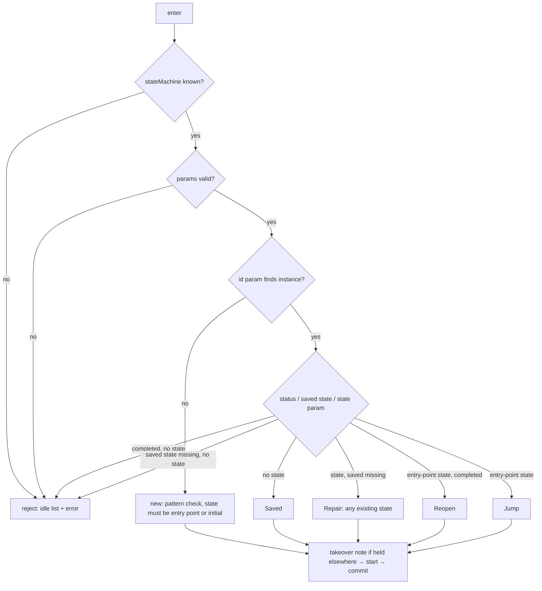
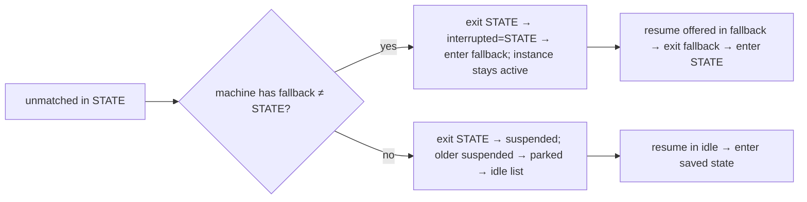

# Design Specification

## Overview

Idle is handled by one component, `IDLE-Idle`, used whenever the session holds no instance. It renders the idle list and serves the two idle events, `enter` and `resume`. The machine-side built-ins (`park`, `unmatched`, `yield`, fallback `resume`) live in ENG-Machine (DESIGN-ENG); their offers and guidance overrides in ENG-Offers. Requirements: REQ-IDLE-idle.md.

## Architecture

AFFECTED LAYERS: smllm-core (engine), app validate

### High-Level Architecture

`enter` resolves the machine, validates params, finds or creates the instance, classifies the arrival, then `start`s it (active, held, `interrupted` cleared, enter target, settle) and reuses ENG-Machine's `commit`.





### Module Organization

```
crates/lib/smllm-core/src/engine/
├── idle.rs      IDLE-Idle: idle list, enter, resume, final hand-off
├── offer.rs     ENG-Offers: idle_offers, built-in guidance (IDLE-1)
└── machine.rs   ENG-Machine: park, unmatched, yield, fallback resume, commit
crates/app/smllm/src/commands/config.rs   saved_states() for validate (IDLE-4)
crates/lib/smllm-format/src/lower/events.rs   built-in params cannot be overridden (IDLE-1)
```

### Architectural Decisions

- IDLE IS NOT A MACHINE STATE: a session in idle has `holding = None`; idle has its own header (`session K · idle`) and offers. Alternatives: a synthetic idle machine
- ARRIVAL KINDS: `New`, `Saved`, `Jump(from)`, `Reopen(from)`, `Repair(from)` select the `Arrived by:` text and the history `from`; all go through the same `start` + `commit`
- JUMP RECORDED AS ENTER: a jump writes a normal history entry with `event: enter`, `from: <old state>`, `to: <target>`; the jump wording is only in the header. Alternatives: a dedicated `jump` event name
- COMBINED ID PARAM IN IDLE: the idle `enter` offer names the id param as all machines' ref params joined (`issueId | ref`); `enter` then accepts only the chosen machine's ref param
- ONE SUSPENDED SLOT: see DESIGN-ENG; the idle list shows at most one `Suspended:` line
- IDLE-4 IN THE APP: saved-state checks need the store, so `smllm validate` does them in the app (`CLI-Commands`), not in `smllm-format`

## Components and Interfaces

### IDLE-Idle

`reply` renders the idle list (optionally with `error:`); `after_final` renders the final state's block and appends the idle list in the same fence; `fire` dispatches `enter`/`resume` and rejects anything else with the offered names. `find` looks up by id, then by ref. `new_instance` generates a unique `i-` id with version 0 (first write makes it 1). `resume` checks the suspended instance is still suspended and held by this session (else clears the slot and reports), and that its saved state exists (else lists all states).

IMPLEMENTS: TURN-7_AC-1, INST-2_AC-1, INST-4_AC-1, INST-10_AC-1, IDLE-3_AC-1, IDLE-6_AC-1, ACT-5_AC-1

```rust
pub(crate) fn reply(turn: &mut Turn<'_, '_>, ok: bool, error: Option<String>) -> Result<Reply, Error>;
pub(crate) fn after_final(turn: &mut Turn<'_, '_>, m: &Machine, inst: &Instance, arrived: String)
    -> Result<Reply, Error>;
pub(crate) fn fire(turn: &mut Turn<'_, '_>, params: &[(String, String)]) -> Result<Reply, Error>;
enum Arrival { New, Saved, Jump(String), Reopen(String), Repair(String) }
fn enter(turn: &mut Turn<'_, '_>, params: &[(String, String)]) -> Result<Reply, Error>;
fn start(turn: &mut Turn<'_, '_>, m: &Machine, inst: &mut Instance, target: &str, from: Option<&str>);
fn find(turn: &mut Turn<'_, '_>, m: &Machine, value: &str) -> Result<Option<Instance>, Error>;
fn new_instance(turn: &mut Turn<'_, '_>, m: &Machine, r#ref: Option<String>, state: String)
    -> Result<Instance, Error>;
fn resume(turn: &mut Turn<'_, '_>) -> Result<Reply, Error>;
```

## Data Models

### Core Types

- ARRIVED-BY TEXT: `enter (new <noun>)`, `enter`, `enter (jump from <S>)`, `enter (reopened from <S>)`, `enter (saved state <S> no longer exists)`, `resume`, `unmatched from <S>`; ` via <A>, <B>` is appended when `always` states were passed

```rust
// Header notes added by idle/built-ins:
// "Took over from session <K> (last active YYYY-MM-DD HH:MM UTC)"
// "Reopened <noun> <label> at <STATE>."
// "Parked <noun> <label> at <STATE>."
// "Suspended <noun> <label> at <STATE>. Handle the request, then fire resume from idle."
// "Parked the previously suspended <label>."
// "Completed <noun> <label>. You are now in idle."
```

The idle list layout is in DESIGN-TURN-turn-loop.md.

## Correctness Properties

- ENG_P-2, ENG_P-3, ENG_P-4 (DESIGN-ENG-engine.md) run over sequences that include every built-in: rejected `enter`/`resume` change nothing, re-entry never lowers visits, and `enter`/`resume` never leave the session in an `always` state
  VALIDATES: TURN-3_AC-1, ENG-3_AC-1, DEC-2_AC-1

## Error Handling

### Idle rejections (idle list + `error:`, `ok: false`)

- NOT_OFFERED: `<event> is not offered in idle (offered: enter[, resume])`
- MISSING_MACHINE: `enter needs param stateMachine`
- UNKNOWN_MACHINE: `enter param stateMachine must be one of: … (got "…")`
- UNKNOWN_PARAM: `enter has no param <k> for <machine> (params: stateMachine, <ref param>, state)`
- BAD_REF: pattern mismatch on a new ref
- NOT_ENTRY_POINT: `<S> is not an entry point of <machine> (entry points: …)`
- SAVED_STATE_MISSING: `saved state <S> of <noun> <label> no longer exists; fire enter with state: one of <all states>` (IDLE-3)
- NO_SUCH_STATE: `<machine> has no state <S>` (repair with an unknown state)
- RESUME_STALE: moved to another session, or no longer suspended; the slot is cleared

### Strategy

PRINCIPLES:

- Every idle rejection re-sends the full idle list so the agent can choose again
- Inside a machine, a missing saved state adds a note telling the agent to `park`, then `enter` with a state; only `park` and `unmatched` are offered there

## Testing Strategy

### Property-Based Testing

- FRAMEWORK: proptest (see DESIGN-ENG)
- MINIMUM_ITERATIONS: 128
- TAG_FORMAT: @zen-test: ENG_P-n

### Unit Testing

`tests/engine.rs` with the `dev` and `help` (fallback `ASIDE`) machines.

- AREAS: idle list snapshot on bind, idle rejections, park + enter again (visit 2, jump, not-an-entry-point), detour via idle and via fallback, second suspend parks the first, final → idle list snapshot, reopen, missing saved state repair

## Requirements Traceability

SOURCE: .zen/specs/REQ-IDLE-idle.md

- IDLE-1_AC-1 → ENG-Offers (`builtin_description`); CFG-Lower forbids built-in param overrides; no @zen-test marker
- IDLE-2_AC-1 → ENG-Machine (`unmatched`, fallback `resume`); from the fallback state itself `unmatched` suspends to idle
- IDLE-3_AC-1 → IDLE-Idle (`enter`, `resume`)
- IDLE-4_AC-1 → CLI-Commands (`saved_states`, app config.rs); no @zen-test marker
- IDLE-5_AC-1 → ENG-Machine (`commit`), IDLE-Idle (`after_final`); covered by the `final` snapshot without a @zen-test marker
- IDLE-6_AC-1 → IDLE-Idle (`Arrival::Jump`) — jump recorded in history as an `enter` entry from→to; the "jump" wording is header-only; tested in `park_and_enter_again` without a @zen-test marker

## Change Log

- 1.0.0 (2026-09-25): Initial design, documenting the P3 implementation
