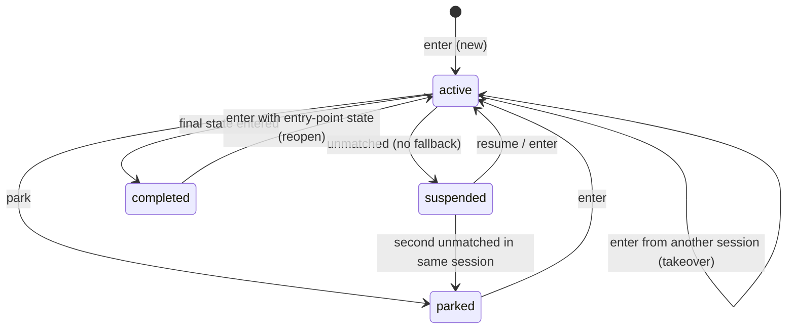

# Design Specification

## Overview

Instances are plain records (`INST-Records`) owned by the core and persisted by the host's `Store`. The engine never mutates the store until a call has been validated; it then writes the instance with `version = stored + 1`, appends one history entry and saves the session. Ids, refs, status, holder, takeover and "moved" are handled by the engine components in DESIGN-ENG (ENG-Machine) and DESIGN-IDLE (IDLE-Idle); this document owns the record shapes and the versioning scheme. Requirements: REQ-INST-instances.md.

## Architecture

AFFECTED LAYERS: smllm-core (records, engine), app store

### High-Level Architecture

A session points at the instance it holds (`holding`) and at most one suspended instance (`suspended`) by `InstanceKey`. The instance names its `holder`. Both sides are checked on every call: the session's view is trusted only if the instance agrees (`held`, INST-7).



```mermaid
sequenceDiagram
    participant A as Session A
    participant B as Session B
    participant S as Store
    B->>S: enter GH-5 (holder A → B), version n+1
    A->>S: fire accept → held(): holder is B
    S-->>A: error "issue GH-5 moved to session B; you are in idle"
```

### Module Organization

```
crates/lib/smllm-core/src/record/
├── instance.rs   INST-Records: Instance, InstanceKey, Status
├── history.rs    INST-Records: HistoryEntry
└── session.rs    STO-Records: Session (DESIGN-STO)
crates/app/smllm/src/store.rs   STO-FileStore: lock + version compare (INST-8_AC-2)
```

### Architectural Decisions

- GENERATED ID IS THE KEY: records and history are keyed by `i-` + 6 Crockford base32 chars from the host's `Ids`, regenerated on collision; the ref is only an alias looked up by scan. Alternatives: ref as key (breaks set-once-later refs)
- LABEL = REF ELSE ID: `Instance::label()` is the one id the agent sees (INST-4); lookup tries the id first, then the ref
- OPTIMISTIC INSTANCE VERSIONS: every write bumps `version`; `Store::put_instance` accepts only `stored + 1` (0 → 1 for new). The file store does that compare-and-write under an OS lock on `<state>/<machine>/.lock`. Side effects of commands that ran before a lost race are not rolled back. Alternatives: pessimistic lock for the call's duration
- ONE SUSPENDED SLOT PER SESSION: a second `unmatched` parks the older suspended instance (see DESIGN-ENG decisions)
- PARAMS ONLY IN HISTORY: `HistoryEntry.params` carries the event's params; `Instance` has no params field (TURN-10)

## Components and Interfaces

### INST-Records

The instance and history record types, serialised camelCase with the `serde` feature (`ref` for `r#ref`). `visits` counts entries per state (ENG-3); `interrupted` is the state `unmatched` left for a fallback state (IDLE-2).

```rust
pub struct InstanceKey { pub machine: String, pub id: String }
pub enum Status { Active, Suspended, Parked, Completed }
impl Status { pub fn as_str(self) -> &'static str; }
pub struct Instance {
    pub id: String, pub machine: String, pub r#ref: Option<String>, pub state: String,
    pub status: Status, pub holder: Option<String>, pub version: u64,
    pub visits: SmallMap<u32>, pub interrupted: Option<String>,
    pub created: u64, pub updated: u64,
}
impl Instance {
    pub fn key(&self) -> InstanceKey;
    pub fn label(&self) -> &str;          // ref, else id (INST-4)
    pub fn visits(&self, state: &str) -> u32;
}
pub struct HistoryEntry {
    pub at: u64, pub session: String, pub event: String,
    pub from: Option<String>, pub to: Option<String>,
    pub params: SmallMap<String>, pub trace: Vec<String>,
}
```

STO-Records (`Session`: key, harness, host session, cwd, configs, `holding`, `suspended`, `yielded`, times) is specified in DESIGN-STO. STO-FileStore (app `store.rs`) implements INST-8_AC-2.

## Data Models

### Core Types

- INSTANCE FILE: `<config dir>/state/<machine>/<id>.json`, pretty JSON of `Instance`; `state/.gitignore` ignores everything (O6)
- HISTORY FILE: `<config dir>/state/<machine>/<id>.history.jsonl`, one `HistoryEntry` per line

```rust
// history trace order: notes, "Passed through: <STATE>" per always state,
// "Guard: …" lines, "Action failed: …" / "Prompt failed: …" lines
```

## Correctness Properties

- ENG_P-2 and ENG_P-3 (DESIGN-ENG-engine.md) cover INST: invalid calls never write an instance; visits and versions never decrease
  VALIDATES: INST-8_AC-1, TURN-3_AC-1

## Error Handling

### Instance errors (returned as replies)

- REF_ALREADY_SET: `<noun> <id> already has its ref <r>; it is set once` (INST-3)
- REF_TAKEN: `another <noun> of <machine> already has ref <v>` (INST-3)
- MOVED: `<noun> <label> moved to session <K>; you are in idle` (INST-7)
- NOT_ACTIVE: `<noun> <label> is <status>; you are in idle` (INST-7)
- GONE: `instance <id> no longer exists; you are in idle`
- CONFLICT: `<noun> <label> was changed by another session; you are in idle` (INST-8)
- COMPLETED_NEEDS_STATE: `<noun> <label> is completed; to reopen it, fire enter with state: one of <entry points>` (INST-10)

### Strategy

PRINCIPLES:

- A session whose hold is no longer valid is cleared (`holding = None`), saved, and shown the idle list with the error
- Ref checks run before any action, so a rejected ref changes nothing

## Testing Strategy

### Property-Based Testing

- FRAMEWORK: proptest (see DESIGN-ENG)
- MINIMUM_ITERATIONS: 128
- TAG_FORMAT: @zen-test: ENG_P-n

### Unit Testing

`tests/engine.rs` (core, fake host) and `store.rs` unit tests (app, real files).

- AREAS: new id shape (INST-2), setRef pattern/twice (INST-3), takeover note with last-active time and moved error (INST-6, INST-7), reopen needs state (INST-10), file store version conflicts, history append, `.gitignore`

## Requirements Traceability

SOURCE: .zen/specs/REQ-INST-instances.md

- INST-1_AC-1 → STO-Records `Session.holding: Option<InstanceKey>`; no instanceless machine state exists; no marker
- INST-2_AC-1 → IDLE-Idle (`new_instance`)
- INST-3_AC-1 → ENG-Machine (`check_set_ref`); new refs at `enter` are pattern-checked in IDLE-Idle and uniqueness follows from lookup-by-ref
- INST-4_AC-1 → IDLE-Idle (`find`), INST-Records (`label`)
- INST-5_AC-1 → INST-Records (`Status`); no marker
- INST-6_AC-1 → ENG-Machine (`takeover_note`), IDLE-Idle
- INST-7_AC-1 → ENG-Machine (`held`, `moved`)
- INST-8_AC-1 → ENG-Machine (`save`), ENG-Host (`MemoryStore`) (ENG_P-3) — the loser's message is "was changed by another session", not "moved to session …"
- INST-8_AC-2 → STO-FileStore (`put_instance`, app store.rs) — only instance writes are locked; session and history writes are not
- INST-9_AC-1 → ENG-Engine; no delete path exists in the protocol or CLI; no marker
- INST-10_AC-1 → IDLE-Idle (`Arrival::Reopen`)
- INST-11_AC-1 → INST-Records; visits and history are never reset on reopen; no marker or dedicated test

## Change Log

- 1.0.0 (2026-09-25): Initial design, documenting the P3/P4 implementation
