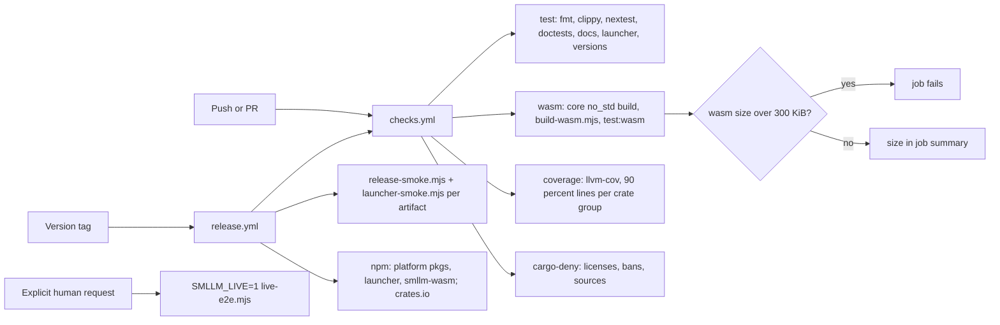

# Design Specification

## Overview

How REQ-NFR and REQ-TEST are met. Neither code has components of its own: each requirement is carried by a component specified elsewhere plus a build, CI or test mechanism described here. The central choices are a `no_std` core behind host traits (NFR-1, D24), a wasm package built and size-checked on every change (NFR-8, D25), hooks that answer through the kit's `emit` (NFR-4), env-only command input (NFR-5), and four test layers (TEST-1..4, D30).

## Architecture

AFFECTED LAYERS: smllm-core, smllm-wasm, smllm app, CI workflows, scripts

### High-Level Architecture



### Module Organization

```
.github/workflows/checks.yml     # CI gate (called by ci.yml and release.yml)
.github/workflows/release.yml    # build, smoke, publish, GitHub release
scripts/build-wasm.mjs           # wasm build + size budget (NFR-8)
scripts/release-smoke.mjs        # smoke of a release binary
scripts/launcher-smoke.mjs       # smoke of the packed npm launcher
scripts/live-e2e.mjs             # TEST-4, human request only
scripts/set-version.mjs, verify-version.mjs
crates/lib/smllm-core/tests/     # engine.rs (snapshots), properties.rs (ENG_P-1..4)
crates/lib/smllm-format/tests/   # validate.rs + fixtures + snapshots
crates/lib/agent-harness-kit/tests/  # harness.rs, properties_harness.rs
crates/app/smllm/tests/          # cli.rs, session.rs (TEST-2), common/ (World)
packages/smllm-wasm/test/        # smoke.test.mjs + dev.json (TEST-3)
```

### Architectural Decisions

- WASM SIZE BUDGET 300 KIB: set after P3 at ~15% over the first measured 258 KiB (web build, after `wasm-opt -Oz`); enforced in `scripts/build-wasm.mjs`, reported via `$GITHUB_STEP_SUMMARY`. Alternatives: report only
- SERDE_JSON IN SMLLM-WASM: compiled machines and store state cross as JSON with `serde_json`; fits the budget, so no smaller JSON crate was added (PLAN-001 §12). Alternatives: miniserde, hand-rolled parser
- CORE BUILT FOR WASM SEPARATELY: `cargo test` links std and masks `no_std` breakage, so CI builds `smllm-core --no-default-features --target wasm32-unknown-unknown`
- LIVE TEST OPT-IN BY ENV: `live-e2e.mjs` exits 2 without `SMLLM_LIVE=1` and is referenced by no workflow or hook
- COVERAGE GATE: nightly `cargo llvm-cov` with ≥ 90% lines separately for library crates and for the app, excluding `smllm-wasm`

## Components and Interfaces

No NFR or TEST components. Carriers:

- NFR-1: ENG-Host (host traits in `smllm-core/src/host`), implemented by DEC-CommandRunner / STO-FileStore in the app and HOST-Wasm in JavaScript
- NFR-2: HOST-Claude — one short-lived process per hook, synchronous file IO, no async runtime (tokio is only started by `smllm mcp`); release profile `opt-level = "z"`, LTO, `panic = "abort"`
- NFR-3: ENG-Engine — all nondeterminism (clock, ids, guard results) comes through the host
- NFR-4: HOST-Claude via `agent_harness_kit::hook::emit`
- NFR-5: DEC-CommandRunner — params reach commands as `SMLLM_PARAM_<NAME>` env; array `run` is exec without a shell
- NFR-6: kit `install` plans all writes and refuses before any write; app commands validate before writing; `write_atomic` for every write
- NFR-7: file-size rule and `.zen/rules/rust-rules.md`; the largest Rust source file is under 600 lines
- NFR-8: HOST-Wasm + `scripts/build-wasm.mjs` + `checks.yml` job `wasm`
- NFR-9: ENG-Engine `unsupported(guards, actions)`, surfaced by HOST-Wasm `unsupported()`; the app does not call it, since its command host supports every v1 kind

The host boundary that makes NFR-1 hold:

```rust
pub struct Host<'a> {
    pub store: &'a mut dyn Store,
    pub guards: &'a mut dyn Guard,
    pub actions: &'a mut dyn Action,
    pub source: &'a dyn InstructionSource,
    pub matcher: &'a dyn Matcher,
    pub clock: &'a dyn Clock,
    pub ids: &'a mut dyn Ids,
}
```

## Data Models

### Core Types

- WASM BUDGET: `BUDGET = 300 * 1024` bytes in `scripts/build-wasm.mjs`, compared with the size of the `web` target's `smllm_wasm_bg.wasm` after `wasm-opt -Oz`; the script prints `smllm_wasm_bg.wasm: <bytes> bytes (<KiB> KiB, budget 300 KiB)`, which CI appends to the job summary

## Correctness Properties

- NFR_P-1 [Deterministic replay]: running the same event sequence twice from a fresh store yields identical texts and stores (ENG_P-1)
  VALIDATES: NFR-3_AC-1
- NFR_P-2 [No write on failure]: a command that exits 2 leaves the file tree byte-identical
  VALIDATES: NFR-6_AC-1

## Error Handling

### Budget and gate failures

- WASM OVER BUDGET: `build-wasm.mjs` prints `error: … over its 300 KiB budget (NFR-8)` and exits 1
- LIVE TEST NOT ENABLED: `live-e2e.mjs` refuses with exit 2 without `SMLLM_LIVE=1`

### Strategy

PRINCIPLES:

- CI checks the shipped shapes (wasm target, release binaries, packed npm tarballs), not only `cargo test`
- Checks that can block unrelated PRs (advisories) run on a schedule, not in the gate

## Testing Strategy

### Property-Based Testing

- FRAMEWORK: proptest
- MINIMUM_ITERATIONS: 64 (engine properties run 128 cases)
- TAG_FORMAT: @zen-test: {CODE}_P-{n}

```rust
// @zen-test: ENG_P-1
#[test]
fn deterministic(steps in proptest::collection::vec(step(), 0..25)) {
    prop_assert_eq!(run(&steps), run(&steps));
}
```

### Unit Testing

TEST-1: `smllm-core/tests/engine.rs` with insta snapshots of entry blocks, idle list, events list, error block, final, re-enter; `properties.rs` for ENG_P-1..4; `smllm-format/tests/validate.rs` with fixtures and snapshots.

- AREAS: engine protocol, agent text, format validation, kit harness parts, command runner, store

### Integration Testing

TEST-2: `crates/app/smllm/tests/session.rs` (fake agent over hooks, `fire`, MCP stdio, showcase example) and `cli.rs`, via `common::World` with isolated `HOME` / `XDG_*`. TEST-3: `packages/smllm-wasm/test/smoke.test.mjs` loads the web build in Node and drives the compiled `examples/dev` machine (bind, enter, stop, accept, param type error, yield, export/import). TEST-4: `scripts/live-e2e.mjs` runs `claude -p` on a two-state `hello` machine and checks the instance is completed with `enter` and `written` in its history.

- SCENARIOS: see DESIGN-HOST-harnesses and DESIGN-CLI-cli integration scenarios

## Requirements Traceability

SOURCE: .zen/specs/REQ-NFR-quality.md, .zen/specs/REQ-TEST-testing.md

- NFR-1_AC-1 → ENG-Host — enforced by the CI `wasm` job's `no_std` build; no marker
- NFR-2_AC-1 → HOST-Claude — measured ~1–2 ms with the release binary; no automated check
- NFR-3_AC-1 → ENG-Engine (NFR_P-1) — tested as ENG_P-1; no NFR marker
- NFR-4_AC-1 → HOST-Claude — via HOST-7_AC-1 test; no NFR marker
- NFR-5_AC-1 → DEC-CommandRunner — env-only by construction; no marker
- NFR-6_AC-1 → HOST-Claude (NFR_P-2) [partial] kit refusal test `every_refusal_leaves_the_tree_byte_identical`; app commands not tested for it
- NFR-6_AC-2 → n/a [n/a] release policy
- NFR-7_AC-1 → n/a [n/a] repository rule; all files within 800 lines
- NFR-8_AC-1 → HOST-Wasm — CI `wasm` job
- NFR-8_AC-2 → HOST-Wasm — `scripts/build-wasm.mjs` budget 300 KiB
- NFR-9_AC-1 → ENG-Engine
- TEST-1_AC-1 → ENG-Engine [partial] tool description and instructions block not snapshotted
- TEST-2_AC-1 → HOST-Claude [partial] `dev` example and reopen not driven end to end
- TEST-3_AC-1 → HOST-Wasm — CI `wasm` job runs `npm run test:wasm`
- TEST-4_AC-1 → HOST-Claude [deferred] script exists; runs only on explicit human request, never in CI

## Library Usage

### External Libraries

- proptest (1): property tests
- insta (1): snapshot tests
- assert_cmd (2): end-to-end binary tests
- binaryen (npm): `wasm-opt`
- wasm-bindgen-cli (0.2): JS glue generation

## Change Log

- 0.1.0 (2026-09-25): Initial design
