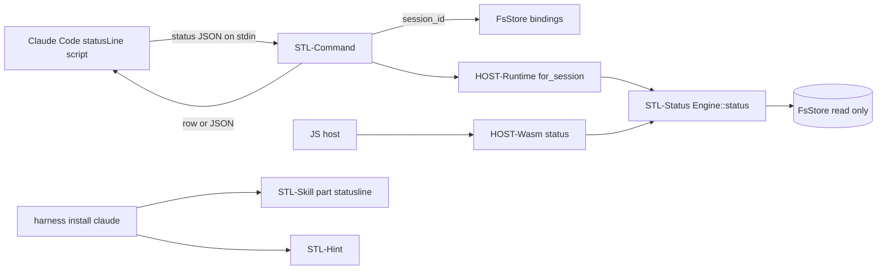

# Design Specification

## Overview

Implements REQ-STL. The engine gains one read-only call, `Engine::status`, which returns a serde `SessionStatus` built from the session record, its held and suspended instances and a count of parked instances. It uses the same checks as the idle list and `held` (a held instance that moved, or whose machine is not configured, reads as idle), but it never writes. The app's `smllm statusline` finds the session (from `--session`, or from the Claude Code status JSON's `session_id` through the binding store), then prints the status as JSON or as the default row. Every failure turns into an empty answer with exit 0. The status line itself stays the user's: a skill (installed as harness part `statusline` and shipped in the plugin) edits it with consent. `harness install|status` only adds a hint.

## Architecture

AFFECTED LAYERS: smllm-core (engine), smllm app (commands/statusline, commands/harness), smllm-wasm, Claude Code plugin, docs

### High-Level Architecture



### Module Organization

```
crates/lib/smllm-core/src/engine/status.rs   # STL-Status
crates/app/smllm/src/commands/statusline.rs  # STL-Command, STL-Row, STL-Hint
crates/app/smllm/src/skills/smllm-statusline/SKILL.md   # STL-Skill (embedded, installed)
plugin/skills/smllm-statusline/SKILL.md      # STL-Skill (plugin copy, test-checked equal)
docs/statusline.md                           # STL-Doc
```

### Architectural Decisions

- DATA NOT TEMPLATES (D2-1): the row is fixed; any other shape is built by the user's script from `--json`. Alternatives: a format string or style table in `config.toml`
- ONE INSTANCE SHAPE: `instance` and `suspended` share `{machine, kind, id, ref, label, status}`, so scripts read both the same way and every key is always present (D2-6, D2-8)
- EMPTY, NOT ERROR: the command maps every error (including an unknown session) to an empty row or `{}`, with exit 0 and the reason on stderr, because a non-zero exit blanks Claude Code's whole status line. Alternatives: the CLI's usual exit 1/2
- COLOUR ALWAYS UNLESS `NO_COLOR`: status line commands never see a TTY, so `auto` cannot use TTY detection
- SKILL AS A FILE PART: the skill is one `Part::files` of the Claude profile, so `--without statusline` and the record work as for other parts. The plugin copy is the same file, and a test checks the two are equal
- HINT OUTSIDE THE KIT: the `statusLine` check is smllm-specific, so the app prints it after the kit's report rather than adding notes to `HarnessResult`

## Components and Interfaces

### STL-Status

Reads the session (unknown → `Error::UnknownSession`). If it holds an instance, that instance must exist, be `active`, be held by this session and belong to a configured machine. If so, the status carries machine, state, visit count of the current state and `instance`. Otherwise it reads as idle (views and the stop hook report the move; the status does not). `suspended` is filled only when that instance is still `suspended` and held by this session, and its machine is configured (as the idle list). `parked` counts parked instances of the configured machines. `yielded` is the session flag. No writes, no guard or action calls.

IMPLEMENTS: STL-3_AC-1, STL-5_AC-1, STL-5_AC-2, STL-8_AC-1

```rust
impl Engine {
    pub fn status(&self, host: &mut Host<'_>, key: &str) -> Result<SessionStatus, Error>;
}
```

### STL-Command

`smllm statusline`. Session key: `--session`, else stdin parsed as the status JSON (`HookInput::parse` reads `session_id`), and then `bindings/claude/<session_id>`. With no key it prints nothing. Otherwise it calls `Runtime::for_session(key)` and `Engine::status`, and prints `{}` / nothing on any error, with `smllm statusline: <reason>` on stderr. JSON goes through `output::json`. The row is written without a trailing newline so that `$(…)` and `printf '\n%s'` compose cleanly.

IMPLEMENTS: STL-1_AC-1, STL-2_AC-1, STL-2_AC-2, STL-4_AC-1

```rust
pub fn statusline(args: &StatuslineArgs) -> Result<u8>; // always Ok(EXIT_OK)
```

### STL-Row

Renders `SessionStatus` as the default row. SGR codes: dim `2`, cyan `36`, bold `1`, magenta `35`, yellow `33`, each reset with `0`. The colour choice is resolved from `--color` and `NO_COLOR` before rendering.

IMPLEMENTS: STL-6_AC-1, STL-6_AC-2, STL-6_AC-3, STL-7_AC-1

```rust
pub(crate) fn row(s: &SessionStatus, color: bool) -> String;
pub(crate) fn use_color(flag: ColorChoice, no_color: Option<&str>) -> bool;
```

### STL-Skill

`SKILL.md` with frontmatter `name: smllm-statusline` and a trigger description. It is embedded in the binary (`include_str!`) as part `statusline` of the Claude profile, in `.claude/skills/smllm-statusline/` (project) or `skills/smllm-statusline/` under `~/.claude` (user). The body gives the steps of PLAN-002 §6 and links to `docs/statusline.md`.

IMPLEMENTS: STL-9_AC-1, STL-9_AC-2, STL-9_AC-3

### STL-Hint

After a text `harness install|status claude` report, reads `statusLine.command` from the scope's settings (project: `.claude/settings.local.json`, then `.claude/settings.json`, then the user's; user: `~/.claude/settings.json`). The first one found wins. It is set up when that command contains `smllm statusline`, or when a file the command names (with `~/` expanded) contains it. Otherwise it prints `note: smllm is not in your Claude Code status line; ask Claude to add it (skill smllm-statusline)` on stderr.

IMPLEMENTS: STL-11_AC-1

```rust
pub(crate) fn statusline_hint(settings: &[PathBuf], home: &Path) -> Option<&'static str>;
```

### STL-Doc

`docs/statusline.md`: quick setup, the default row, the JSON contract, recipes, other harnesses.

IMPLEMENTS: STL-10_AC-1

## Data Models

### Core Types

- SESSIONSTATUS: the STL-5 object

```rust
#[serde(rename_all = "camelCase")]
pub struct SessionStatus {
    pub session: String,
    pub idle: bool,
    pub machine: Option<String>,
    pub state: Option<String>,
    pub visit: Option<u32>,
    pub yielded: bool,
    pub instance: Option<InstanceStatus>,
    pub suspended: Option<InstanceStatus>,
    pub parked: u32,
}

#[serde(rename_all = "camelCase")]
pub struct InstanceStatus {
    pub machine: String,
    pub kind: String,
    pub id: String,
    #[serde(rename = "ref")]
    pub r#ref: Option<String>,
    pub label: String,
    pub status: String, // active | suspended | …
}
```

## Correctness Properties

- STL_P-1 [Status is read-only]: for any session and store, `status` leaves the store byte-for-byte unchanged and calls no guard or action
  VALIDATES: STL-3_AC-1
- STL_P-2 [Status agrees with the view]: `status.idle` is true exactly when `view` renders the idle list
  VALIDATES: STL-5_AC-1

## Error Handling

### StatuslineFailure

Any failure of `statusline`, printed to stderr only.

- NO_SESSION: no `session_id`, no binding or unknown key; nothing on stderr
- STORE: the store or config could not be read; `smllm statusline: <reason>`

### Strategy

PRINCIPLES:

- Exit 0 always; stdout is the row, `{}` or nothing (STL-4)

## Testing Strategy

### Property-Based Testing

- FRAMEWORK: proptest
- MINIMUM_ITERATIONS: 64
- TAG_FORMAT: `// @zen-test: STL_P-n`

### Unit Testing

- AREAS: status in a machine, in idle with suspended and parked, moved or unconfigured holding reads idle; row rendering with and without colour (snapshots); colour choice; hint detection; skill part and plugin copy equal

### Integration Testing

- SCENARIOS: `smllm statusline` from stdin JSON through a bound session (row and `--json` snapshots); unbound, garbage stdin and unknown `--session` print nothing and exit 0; `harness install claude` writes the skill and `--without statusline` leaves it out

## Requirements Traceability

SOURCE: .zen/specs/REQ-STL-statusline.md

- STL-1_AC-1 → STL-Command
- STL-2_AC-1 → STL-Command
- STL-2_AC-2 → STL-Command
- STL-3_AC-1 → STL-Status (STL_P-1)
- STL-3_AC-2 → STL-Command (measured ~2 ms per run, release build, 2026-09-25)
- STL-4_AC-1 → STL-Command
- STL-5_AC-1 → STL-Status (STL_P-2)
- STL-5_AC-2 → STL-Status
- STL-6_AC-1 → STL-Row
- STL-6_AC-2 → STL-Row
- STL-6_AC-3 → STL-Row
- STL-7_AC-1 → STL-Row
- STL-8_AC-1 → STL-Status
- STL-9_AC-1 → STL-Skill
- STL-9_AC-2 → STL-Skill
- STL-9_AC-3 → STL-Skill
- STL-10_AC-1 → STL-Doc
- STL-11_AC-1 → STL-Hint

## Change Log

- 0.1.0 (2026-09-25): Initial design from PLAN-002
