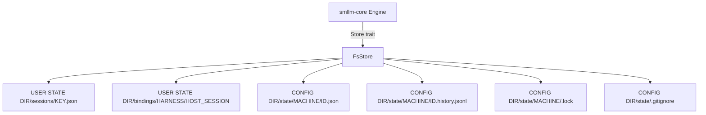

# Design Specification

## Overview

Implements REQ-STO with a plain-file store behind the core's `Store` trait. The core owns the record types (STO-Records, INST-Records) and never touches the file system; the app's `FsStore` maps them to JSON files, choosing the user state dir for sessions and bindings and each machine's config-side `state/` dir for instances. Writes are temp-file-plus-rename; instance writes add a per-machine lock file and an optimistic version check.

## Architecture

AFFECTED LAYERS: smllm-core (records, `Store` trait), smllm app (store, paths, runtime)

### High-Level Architecture

`HOST-Runtime` builds an `FsStore` from the user state dir (CLI-Lookup) and a map of machine id → state dir (from `smllm-format`'s `MachineSource.state_dir`, i.e. `<config dir>/state`). The engine reads and writes only through the `Store` trait.



### Module Organization

```
crates/lib/smllm-core/src/
├── host/traits.rs        # Store trait, HostError (Conflict | Other)
├── host/memory.rs        # MemoryStore (tests, wasm)
└── record/
    ├── session.rs        # Session (STO-Records)
    ├── instance.rs       # Instance, Status, InstanceKey (INST-Records)
    └── history.rs        # HistoryEntry (INST-Records)
crates/app/smllm/src/
├── store.rs              # FsStore, write_atomic (STO-FileStore)
├── paths.rs              # user_state_dir (CLI-Lookup)
└── runtime.rs            # builds FsStore per call (HOST-Runtime)
```

### Architectural Decisions

- PLAIN JSON FILES: one file per session and instance, JSONL history, human-inspectable and diff-free to append. Alternatives: SQLite, one JSON file per project
- OPTIMISTIC VERSION UNDER A LOCK: the lock serialises the read-compare-write; the version detects a writer that loaded before another's commit (INST-8). Alternatives: lock for the whole call (holds a lock across guard commands that may run minutes)
- STD FILE LOCK: `File::lock` (advisory, released on unlock or close); no `fs4` dependency. Alternatives: `fs4`, lock directories
- BINDING AS A TEXT FILE: `bindings/<harness>/<host session id>` holds just the key, so a lookup is one read. Alternatives: an index file needing a lock
- HISTORY APPEND WITHOUT LOCK: `O_APPEND` single-line writes; history is written after the versioned instance write succeeds. Alternatives: include history in the lock

## Components and Interfaces

### STO-Records

Serde-derivable session record in the core (`serde` feature, camelCase). `configs` is opaque to the core: the app stores config paths there at bind (STO-2) and `HOST-Runtime::for_session` reads them back. `holding` / `suspended` point at instances by `InstanceKey { machine, id }`.

```rust
pub struct Session {
    pub key: String,                 // sm-xxxxxx (HOST-2)
    pub harness: String,             // claude | mcp | none | wasm
    pub host_session: Option<String>,
    pub cwd: String,                 // DEC-7 working dir
    pub configs: Vec<String>,        // STO-2
    pub holding: Option<InstanceKey>,
    pub suspended: Option<InstanceKey>,
    pub yielded: bool,               // TURN-4, TURN-8
    pub created: u64,
    pub last_active: u64,
}
```

### STO-FileStore

`FsStore` implements `Store`. Paths: sessions at `<user>/sessions/<safe(key)>.json`; bindings at `<user>/bindings/<safe(harness)>/<safe(host_session)>` (plain text key); instances at `<state_dir>/<safe(machine)>/<safe(id)>.json`, history beside as `<id>.history.jsonl`. `safe()` keeps `[A-Za-z0-9-]` and %-escapes every other byte (`%5F` for `_`), so distinct ids never share a file. `write_atomic` creates parent dirs, writes `.<name>.tmp<pid>` beside the target and renames over it; it is also used by `init`, `new --write` and `compile -o`. `put_instance` creates the machine dir, drops `state/.gitignore` (`*`) if absent, opens `.lock`, takes `File::lock`, re-reads the stored version, writes only when `instance.version == stored + 1` else returns `HostError::Conflict`, then unlocks. Unknown machines read as empty (no instances) and fail on write. `sessions()` lists newest first for `session list`; `history()` parses the JSONL for `instance show`.

IMPLEMENTS: STO-3_AC-1, INST-8_AC-2

```rust
pub struct FsStore { /* user: PathBuf, machines: HashMap<String, PathBuf> */ }

impl FsStore {
    pub fn new(user: PathBuf, machines: HashMap<String, PathBuf>) -> Self;
    pub fn sessions(&self) -> Result<Vec<Session>, HostError>;
    pub fn history(&self, machine: &str, id: &str) -> Result<Vec<HistoryEntry>, HostError>;
}

pub fn write_atomic(path: &Path, text: &str) -> std::io::Result<()>;

impl Store for FsStore {
    fn session(&mut self, key: &str) -> Result<Option<Session>, HostError>;
    fn put_session(&mut self, session: &Session) -> Result<(), HostError>;
    fn binding(&mut self, harness: &str, host_session: &str) -> Result<Option<String>, HostError>;
    fn put_binding(&mut self, harness: &str, host_session: &str, key: &str) -> Result<(), HostError>;
    fn instance(&mut self, machine: &str, id: &str) -> Result<Option<Instance>, HostError>;
    fn instances(&mut self, machine: &str) -> Result<Vec<Instance>, HostError>;
    fn put_instance(&mut self, instance: &Instance) -> Result<(), HostError>;
    fn append_history(&mut self, machine: &str, id: &str, entry: &HistoryEntry) -> Result<(), HostError>;
}
```

## Data Models

### Core Types

- HOST_ERROR: store failures the engine understands; `Conflict` becomes the "moved" reply (INST-8)

```rust
pub enum HostError { Conflict, Other(String) }
```

### Entities

### Session file
`<user state dir>/sessions/<key>.json`, pretty JSON of `Session`
- KEY (string, required): session key
- CONFIGS (string[], optional): config paths recorded at creation (STO-2)
- HOLDING (InstanceKey, optional): held instance; absent = idle

### Instance file
`<config dir>/state/<machine>/<id>.json`, pretty JSON of `Instance` (see INST design)
- VERSION (u64, required): incremented on every write (STO-3_AC-2)

### History file
`<config dir>/state/<machine>/<id>.history.jsonl`, one `HistoryEntry` JSON per line, append-only

## Correctness Properties

- STO_P-1 [No partial files]: after any interruption each stored file is either its previous or its new complete content
  VALIDATES: STO-3_AC-1
- STO_P-2 [Versioned writes]: a `put_instance` succeeds iff its version is the stored version + 1; two writers that loaded the same version cannot both succeed
  VALIDATES: STO-3_AC-2
- STO_P-3 [Session config stability]: every call on a session loads the configs recorded at its creation, whatever the caller's cwd
  VALIDATES: STO-2_AC-1

## Error Handling

### HostError

- CONFLICT: version mismatch; the engine reports "moved to session …" (INST-7, INST-8)
- OTHER: I/O or JSON error, with the path; the CLI reports `error:` and exits 2

### Strategy

PRINCIPLES:

- Missing files read as `None` / empty, never as errors
- Unparseable files are errors naming the path, never silently replaced
- The lock is released on every path, including conflicts

## Testing Strategy

### Property-Based Testing

- FRAMEWORK: proptest
- MINIMUM_ITERATIONS: 64
- TAG_FORMAT: @zen-test: STO_P-{n}

No STO property tests yet; STO_P-2 is exercised by the unit test below and by the engine properties over `MemoryStore`.

### Unit Testing

`store.rs` unit test: version conflicts, `.gitignore` creation, history append/read, bindings, sessions round-trip.

- AREAS: STO-FileStore

### Integration Testing

Scripted sessions (`crates/app/smllm/tests/session.rs`) run the real binary with isolated `XDG_STATE_HOME` / `XDG_CONFIG_HOME` / `HOME` and assert `.smllm/state/.gitignore`, takeover and "moved" replies.

- SCENARIOS: takeover between two sessions, instance list/show from files, session list

## Requirements Traceability

SOURCE: .zen/specs/REQ-STO-storage.md

- STO-1_AC-1 → STO-FileStore — exercised by session.rs; no `@zen-test` marker
- STO-1_AC-2 → STO-FileStore — asserted in the store unit test and session.rs; no marker
- STO-2_AC-1 → STO-Records (STO_P-3) — recorded by the engine at bind, read back by HOST-Runtime `for_session`; no marker
- STO-3_AC-1 → STO-FileStore (STO_P-1) — store unit test; no test of an interrupted write
- STO-3_AC-2 → STO-FileStore (STO_P-2) — code marker is INST-8_AC-2; unit-tested, no STO marker

## Library Usage

### Framework Features

- STD FILE LOCK: `File::lock` / `unlock` on `<machine>/.lock`

### External Libraries

- serde_json (1): file formats
- etcetera (0): user state dir (via CLI-Lookup)

## Change Log

- 0.1.0 (2026-09-25): Initial design
