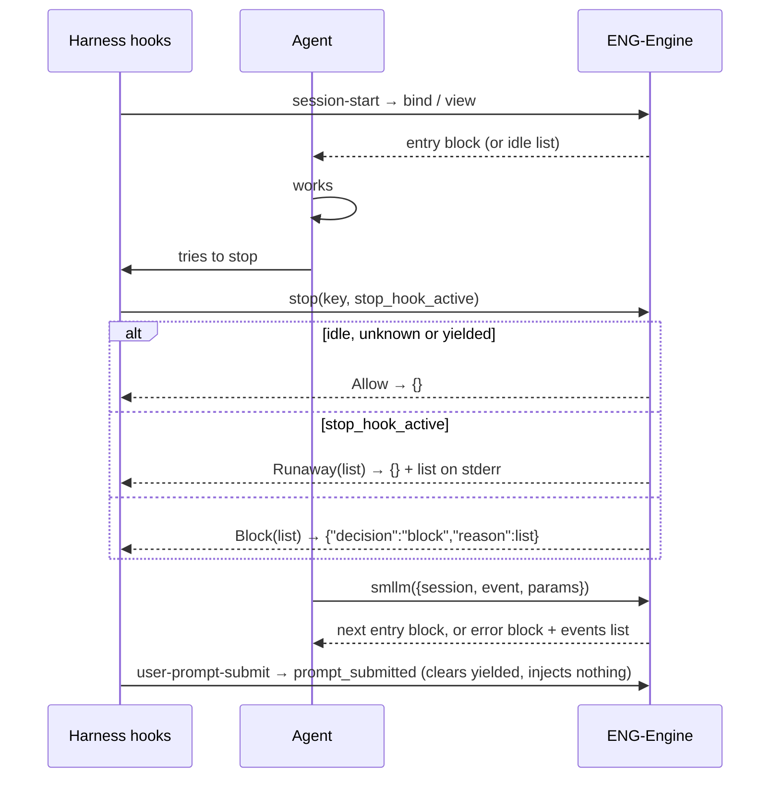

# Design Specification

## Overview

All agent text is produced by one renderer, `TURN-Render` (`smllm-core/src/render`), driven by ENG-Machine and IDLE-Idle, so the `<smllm>` contract has a single source. The stop-hook decision and the user-prompt reset live in ENG-Engine (`stop`, `prompt_submitted`); the harness adapter (`crates/app/smllm/src/commands/harness.rs`, DESIGN-HOST) maps them to Claude Code hook JSON. Requirements: REQ-TURN-turn-loop.md.

## Architecture

AFFECTED LAYERS: smllm-core (render, engine api), app harness hooks

### High-Level Architecture



### Module Organization

```
crates/lib/smllm-core/src/render/
├── block.rs   TURN-Render: Block builder (fence, lines, instructions, events)
└── text.rs    TURN-Render: header, idle_header, quote, format_utc, AGENT_RULES
crates/lib/smllm-core/src/engine/api.rs     stop, prompt_submitted (ENG-Engine)
crates/lib/smllm-format/src/lower/actions.rs  check_fences (CFG-Lower, TURN-12_AC-2)
crates/lib/smllm-core/tests/snapshots/      the text contract (TURN-11)
```

### Architectural Decisions

- ONE FENCE PER REPLY: every reply is one `Block` opened with a header and closed with `</smllm>`. A final state's block and the idle list that follows share that one fence, so the reply may contain two `<instructions>` sections. Alternatives: two fenced blocks
- ENTRY BLOCKS CARRY NO MENU: after a valid transition the reply has header, arrival lines and `<instructions>` only; the events list comes from the stop hook, the no-event view and errors (D2)
- MENU FOLLOWS A CALL LINE: every `<events>` section is preceded by `Fire one event: smllm({ session: "<key>", event, params })`
- PARAMS ON THEIR OWN LINES: every param, including `yield`'s `note`, is an indented line under its event
- EMPTY INSTRUCTIONS OMITTED: no `<instructions>` section is written when there is no prompt text
- VALUES QUOTED: params are shown as `name = "value"` with `"`, `\` and newlines escaped, so author and agent text cannot break the line structure
- AGENT RULES OUTSIDE THE BLOCKS: the TURN-9 rules are the `AGENT_RULES` constant, carried by the MCP tool description and the `AGENTS.md`/`CLAUDE.md` block (HOST-12, D29), not repeated in each `<instructions>`
- RUNAWAY BY HARNESS FLAG: `stop_hook_active` releases the agent; sokf's same-report hash fallback is not implemented because no supported harness lacks the flag yet

## Components and Interfaces

### TURN-Render

`Block` accumulates one fenced reply. `header` builds the first line; `events` renders the call line and the `<events>` section from ENG-Offers' `Offer`s; `instructions` joins prompt texts with a blank line (each trimmed at the end). `AGENT_RULES` is the rules text; `format_utc` renders times without `std` (civil-from-days).

IMPLEMENTS: TURN-1_AC-1, TURN-2_AC-1, TURN-9_AC-1, TURN-12_AC-1

```rust
pub(crate) struct Block { out: String }
impl Block {
    pub(crate) fn open(header: &str) -> Self;              // "<smllm>\n" + header
    pub(crate) fn line(&mut self, line: &str) -> &mut Self;
    pub(crate) fn lines(&mut self, lines: &[String]) -> &mut Self;
    pub(crate) fn instructions(&mut self, prompts: &[String]) -> &mut Self;
    pub(crate) fn events(&mut self, key: &str, offers: &[Offer]) -> &mut Self;
    pub(crate) fn close(&mut self) -> String;             // + "</smllm>\n"
}
pub(crate) fn header(key: &str, machine: &str, state: &str, visit: u32, kind: &str, label: &str) -> String;
pub(crate) fn idle_header(key: &str) -> String;
pub(crate) fn quote(value: &str) -> String;
pub fn format_utc(ms: u64) -> String;                     // "YYYY-MM-DD HH:MM UTC"
pub const AGENT_RULES: &str;
```

The stop and prompt entry points are ENG-Engine (DESIGN-ENG-engine.md).

## Data Models

### Core Types

- HEADER: `session <key> · <machine> › <STATE>[ (visit n)] · <kind> <label>`; `(visit n)` only when n ≥ 2; idle: `session <key> · idle`

- MACHINE BLOCK LINE ORDER: header, `Arrived by: …`, `Params: …`, notes, `Guard: …` trace, `Action failed:`/`Prompt failed:`/always failures, `error: …`, `<instructions>`, call line + `<events>`

- ENTRY BLOCK (valid transition)

```rust
/*
<smllm>
session sm-n0zmmz · dev › WORK (visit 2) · issue GH-7
Arrived by: submit from WORK
Params: summary = "fix"
Guard: command `cargo test --quiet` → false (exit 1)
Guard: visits WORK ≥ 3 → false (visits: 1)
<instructions>
Work on one issue at a time.

Fix it. Add tests.
</instructions>
</smllm>
*/
```

- EVENTS LIST (stop hook, view without `<instructions>` when the state has no prompt)

```rust
/*
<smllm>
session sm-n0zmmz · dev › REVIEW · issue GH-1
Fire one event: smllm({ session: "sm-n0zmmz", event, params })
<events>
- approve
- reject — Select when a review checklist item fails.
    reason (required): Which checklist item failed.
    severity (optional, one of: minor, major): How much rework.
- yield — Stop for now and stay in REVIEW.
    note (optional): What you are waiting for.
- park — Put issue GH-1 aside and return to idle.
- unmatched — The request fits none of these; handle it from idle, then resume.
</events>
</smllm>
*/
```

- PARAM LINE: `    <name> (required|optional[, one of: a, b][, pattern: P])[: <prompt>]`

- ERROR BLOCK: header, `error: <what was wrong>`, call line, `<events>`; params are not echoed

```rust
/*
<smllm>
session sm-n0zmmz · dev › REVIEW · issue GH-3
error: reject param severity must be one of: minor, major (got "huge")
Fire one event: smllm({ session: "sm-n0zmmz", event, params })
<events>
…
</events>
</smllm>
*/
```

- IDLE LIST: idle header, notes/errors, `[idle] on-enter` text as `<instructions>`, `State machines:` (or `No state machines are configured.`), per machine `- <id>[ — <description>]`, `    <kind> id param: <param>[ — <description>][ (pattern: P)]`, `    starts at: <initial>[; entry points: A, B]`; then `Suspended: <kind> <label> (<machine>) at <STATE>`; `Parked:` + `- <kind> <label> (<machine>) at <STATE>` sorted by machine then label; then the events list (`enter`, plus `resume` when suspended)

```rust
/*
<smllm>
session sm-n0zmmz · idle
<instructions>
Pick work from the list.
</instructions>
State machines:
- dev — Fix an issue end to end.
    issue id param: issueId — The GitHub issue id, e.g. GH-123. (pattern: ^GH-\d+$)
    starts at: TRIAGE; entry points: TRIAGE, REVIEW
- help
    instance id param: ref
    starts at: ASK; entry points: ASK
Fire one event: smllm({ session: "sm-n0zmmz", event, params })
<events>
- enter — Start a new instance of a state machine, or continue one.
    stateMachine (required, one of: dev, help): The state machine to enter.
    issueId | ref (optional): The id param its state machine names above: …
    state (optional): Enter here instead: an entry point. …
</events>
</smllm>
*/
```

- FINAL STATE: the final state's block (header, `Arrived by`, params, notes, trace, failures, `<instructions>`), then `Completed <kind> <label>. You are now in idle.`, then the idle list body (without a second header) in the same fence

- YIELD REPLY: header + `Yielded: staying in <STATE>. You may end your turn.`; no menu

- DIFFERENCES FROM THE PLAN §7 SKETCH: `yield`'s `note` is an indented param line, not inline text; the idle list layout above is new (the plan only lists its contents); a final state's block and the idle list share one fence; `Guard:` trace lines and `via <STATE>` in `Arrived by` show branching; failed actions read `Action failed: <STATE> entry[i] <kind>: <detail>` (or `<STATE> exit[i]`, `<SOURCE> transition actions[i]`, `sharedActions[n] entry[i]`; plan: `Action failed: entry[i] …`); a `Fire one event:` line precedes `<events>` in error blocks too; events without guidance show only their name; header notes (takeover, reopen, park, suspend) sit between `Params:` and the trace

## Correctness Properties

- ENG_P-1 (DESIGN-ENG): identical inputs render identical text
  VALIDATES: NFR-3, TURN-11_AC-1
- ENG_P-2 (DESIGN-ENG): an error block never comes with a store change
  VALIDATES: TURN-3_AC-1

## Error Handling

### Stop decisions

- ALLOW: unknown session, idle, or yielded since the last prompt
- BLOCK: machine state, not yielded; reason = events list
- RUNAWAY: as BLOCK but `stop_hook_active`; the harness allows the stop and prints the list to stderr

### Strategy

PRINCIPLES:

- The stop hook never fails the agent: unknown keys allow (NFR-4, HOST-7)
- Rejections always include the events list so the agent can retry in one call

## Testing Strategy

### Property-Based Testing

- FRAMEWORK: proptest (see DESIGN-ENG)
- MINIMUM_ITERATIONS: 128
- TAG_FORMAT: @zen-test: ENG_P-n

### Unit Testing

`text.rs` tests (header visit rule, quoting, UTC dates); insta snapshots in `tests/snapshots/engine__*.snap` pin every text shape: idle list on bind, new-instance entry, arrival with params, guarded re-entry with trace, final + idle list, stop-hook menu, read-only view, error block.

- AREAS: TURN-Render, ENG-Engine stop/prompt_submitted

### Integration Testing

`crates/app/smllm/tests/session.rs` drives the real hooks: idle stop allowed, block until `yield`, runaway with `stop_hook_active`, prompt clears yield, hook JSON shape.

- SCENARIOS: hooks_and_fire_through_the_showcase

## Requirements Traceability

SOURCE: .zen/specs/REQ-TURN-turn-loop.md

- TURN-1_AC-1 → TURN-Render (`header`), ENG-Machine (`block`)
- TURN-2_AC-1 → TURN-Render (`events`), ENG-Offers
- TURN-3_AC-1 → ENG-Offers (`check_params`), ENG-Machine (`reject`) (ENG_P-2)
- TURN-4_AC-1 → ENG-Engine (`stop`)
- TURN-5_AC-1 → ENG-Engine (`stop`)
- TURN-6_AC-1 → ENG-Engine (`stop`) [partial] `stop_hook_active` path implemented; sokf same-report hash fallback for harnesses without `stop_hook_active`: deferred — no such harness yet
- TURN-7_AC-1 → IDLE-Idle (`reply`) — also returned by `view`/`menu` in idle and on idle errors
- TURN-8_AC-1 → ENG-Engine (`prompt_submitted`)
- TURN-9_AC-1 → TURN-Render (`AGENT_RULES`) — delivered via the MCP tool description and the harness instructions block, not in `<instructions>`
- TURN-10_AC-1 → INST-Records (`HistoryEntry.params`; `Instance` has no params); no marker
- TURN-11_AC-1 → insta snapshots in smllm-core tests; no @zen-test marker
- TURN-12_AC-1 → TURN-Render (`Block`)
- TURN-12_AC-2 → CFG-Lower (`check_fences`)

## Library Usage

### External Libraries

- insta (1.47, dev): snapshot tests of the text contract

## Change Log

- 1.0.0 (2026-09-25): Initial design, documenting the P3/P5 implementation
